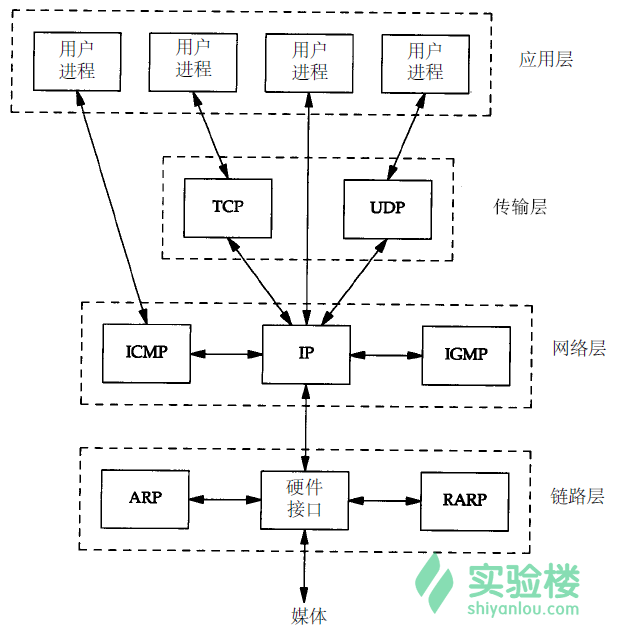
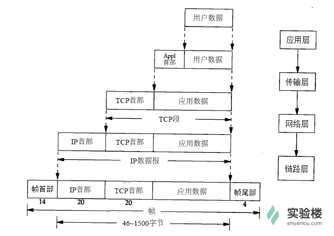

## TCP/IP详解 

- (1)应用层：应用程序通过这一层访问网络，常见 FTP、HTTP、DNS 和 TELNET 协议；

- (2)传输层：TCP 协议和 UDP 协议；

- (3)网络层：IP 协议，ARP、RARP 协议，ICMP 协议等；

- (4)网络接口层：是 TCP/IP   协议的基层，负责数据帧的发送和接收。

- SMTP（简单邮件传输协议）服务器的 TCP 端口号都是 25，
- FTP（文件传输协议）服务器的 TCP 端口号都是 21，
- TFTP(简单文件传输协议)服务器的 UDP 端口号都是 69。

5、封装和分用

封装：当应用程序发送数据的时候，数据在协议层次当中从顶向下通过每一层，每一层都会对数据增加一些首部或尾部信息，这样的信息称之为协议数据单元（Protocol Data Unit，缩写为PDU），在分层协议系统里，在指定的协议层上传送的数据单元，包含了该层的协议控制信息和用户信息。如下图所示：

    - 物理层（一层）PDU指数据位（Bit）

    - 数据链路层（二层）PDU指数据帧（Frame）

    - 网络层（三层）PDU指数据包（Packet）

    - 传输层（四层）PDU指数据段（Segment）

    - 第五层以上为数据（data）

- 分用：当主机收到一个数据帧时，数据就从协议层底向上升，通过每一层时，检查并去掉对应层次的报文首部或尾部，与封装过程正好相反。

- 6、RFC
RFC（Request for Comment）文档是所有以太网协议的正式标准，并在其官网上面公布，由 IETF 标准协会制定。大量的 RFC 并不是正式的标准，出版的目的只是为了提供信息。RFC 的篇幅不一，从几页到几百页不等。每一种协议都用一个数字来标识，如 RFC 3720 是 iSCSI 协议的标准，数字越大说是 RFC 的内容越新或者是对应的协议（标准）出现的比较晚。
所有的 RFC 文档都可以从网络上找到，其官网为IETF。在网站上面可以通过分类以及搜索快速找到目标协议的 RFC 文档。目前在 IETF 网站上面的 RFC 文档有数千个，但是我们不需要全部掌握，在工作或学习中如果遇到可以找到对应的解释，理论与实际结合会有更好地效果，单纯阅读 RFC 的效果一般。


## 网络层其它协议

网络层不仅有 IP 协议，还有其它如 ARP、ICMP 等其它协议，这一节我们将对这些协议做介绍。


### 一、ARP(Address Resolution Protocol)地址解析协议

**功能**

当主机通过数据链路发送数据的时候， **IP 数据报** 会先被封装为一个 **数据帧** ，而 **MAC 地址** 会被添加到数据帧的 **报头** （链路层介绍时已讲过）。 ARP 便是在这个过程中通过目标主机的 IP 地址，查询目标主机的 MAC 地址。

**原理**

在你的电脑和路由器中都有一个 **ARP 缓存表** ，其中保存的是近期(20 分钟)与自己有过通信的主机的 IP 地址与 MAC 地址的对应关系。

ARP 缓存表使用过程：

*   当主机要发送一个 IP 数据报的时候，会首先查询一下自己的 ARP 缓存表；

*   如果在 ARP 缓存表中找到对应的 MAC 地址，则将 IP 数据报封装为数据帧，把 MAC 地址放在帧首部，发送数据帧；

*   如果查询的 IP－MAC 值对不存在，那么主机就向网络中广播发送一个 ARP 请求数据帧，ARP 请求中包含待查询 IP 地址；

*   网络内所有收到 ARP 请求的主机查询自己的 IP 地址，如果发现自己符合条件，就回复一个 ARP 应答数据帧，其中包含自己的 MAC 地址；

*   收到 ARP 应答后，主机将其 IP - MAC 对应信息存入自己的 ARP 缓存，然后再据此封装 IP 数据报，再发送数据帧。

你可以通过命令 **arp -a** 查看 ARP 缓存表(表项记录 20 分钟超时)，这里还有其它 ARP 命令可以对缓存表做查看、修改：


**ARP 代理**

如果 ARP 请求是从一个网络上的主机发往另一个网络上的主机，那么连接这两个网络的路由器就可以回答该 ARP 请求，这个过程称作 **代理 ARP**（Proxy ARP）。

当连接这两个网络的路由器收到该 ARP 请求时，它会发现自己有通向目的主机的路径，随后它会将自己(路由器)的 MAC 地址回复给源主机。源主机会认为路由器的 MAC 地址就是目的主机的 MAC 地址，而对于随后发来的数据帧，路由器会转发到它后面真实 MAC 地址的目的主机。

两个物理网络之间的路由器可以使这两个网络彼此透明化，在这种情况下，只要路由器设置成一个 ARP 代理，以响应一个网络到另一个网络主机的 ARP 请求，两个物理网络就可以使用相同的网络号。

**ARP 欺骗**

从 ARP 代理的原理可以看出来：IP - MAC 的对应信息很容易被伪造！黑客可以伪造 ARP 应答数据帧而欺骗 ARP 请求者，从而达到截获数据的目的。

### 二、RARP(Reverse Address Resolution Protocol)逆向地址解析协议

听名字就知道，RARP 与 ARP 是相反的关系，用于将 MAC 地址转换为 IP 地址。对应于 ARP，RARP 请求以广播方式传送，而 RARP 应答一般是单播传送的。

某些设备，比如无盘机在启动时可能不知道自己的 IP 地址，它们可以将自己的 MAC 地址使用 RARP 请求广播出去，RARP 服务器就会响应并回复无盘机的 IP 地址。

> 
> 
> RARP 在目前的应用中已极少被使用，不再赘述了。
> 
> 

### 三、ICMP(Internet Control Message Protocol)控制报文协议

通信过程中的发生各种问题时，ICMP 将问题反馈，通过这些信息，管理者可以对所发生的问题作出诊断，然后采取适当的措施去解决它。

ICMP 报文由 8 位错误类型、8 位条件代码和 16 位校验和组成，被封装在一个 IP 数据报中：


报文的类型字段可以有 15 个不同的值，以便描述特定类型的 ICMP 报文，代码字段的值进一步描述不同的条件，各类型的报文及其处理方法如图所示：


也有一些出现差错而不产生 ICMP 报文的情况：

*   1.ICMP 差错报文

*   2 . 目的地址是广播或多播地址

*   3.作为链路层广播的数据报

*   4.不是 IP 分片的第一片

*   5.源地址不是单个主机的数据报（源不能为零地址、环回地址、广播多播地址）

### 四、ping 程序和 traceroute 程序

ping 程序和 traceroute 程序是两个常见的 **基于 ICMP 协议** 的工具。

**ping**

ping 程序是对两台主机之间连通性进行测试的基本工具，它只是利用 ICMP 回显请求和回显应答报文，而不用经过传输层（TCP/UDP）。

ping 程序通过在 ICMP 报文数据中存放发送请求的时间值来计算往返时间，当应答返回时，用当前时间减去存放在 ICMP 报文中的时间值，即是往返时间。

ping 程序使用方法为 **ping IP 地址** ，ping 命令还可以加上参数，实现更多的功能：

*   -n 只输出数值。
*   -q 不显示任何传送封包的信息，只显示最后的结果。
*   -r 忽略普通的 Routing Table，直接将数据包送到远端主机上。通常是查看本机的网络接口是否有问题。
*   -R 记录路由过程。
*   -v 详细显示指令的执行过程。
*   -c 数目：在发送指定数目的包后停止。
*   -i 秒数：设定间隔几秒送一个网络封包给一台机器，预设值是一秒送一次。
*   -t 存活数值：设置存活数值 TTL 的大小。

**traceroute**

traceroute 程序是用来侦测主机到目的主机之间所经路由情况的重要工具。刚才 ping 程序中讲过，带 -R 参数的 ping 命令也可以记录路由过程，但是，因为 IP 数据报头的长度限制(最多能保存 9 个 IP 地址)，ping 不能完全的记录下所经过的路由器，traceroute 正好就填补了这个缺憾。

实验楼环境没有 traceroute 程序，需要使用以下命令安装：

```
sudo apt-get install traceroute

```

traceroute 程序的工作原理很简单：

*   它发送一份 TTL 为 1 的 IP 数据报给目的主机，经过第一个路由器时，TTL 值被减为 0，则第一个路由器丢弃该数据报，并返回一份超时 ICMP 报文，于此得到了路径中第一个路由器的地址；

*   然后再发送一份 TTL 值为 2 的数据报，便可得到第二个路由器的地址；

-以此类推，一直到到达目的主机为止，这样便记录下了路径上所有的路由 IP。
