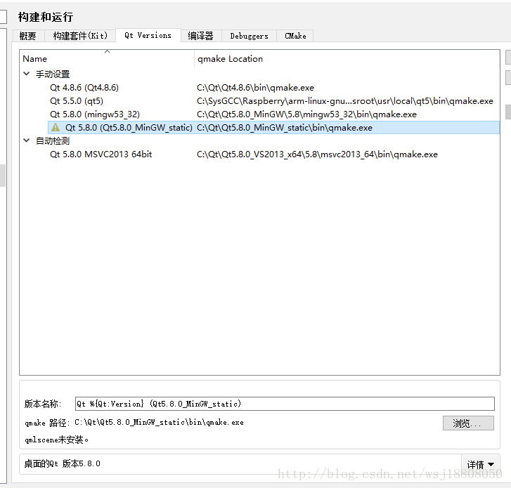
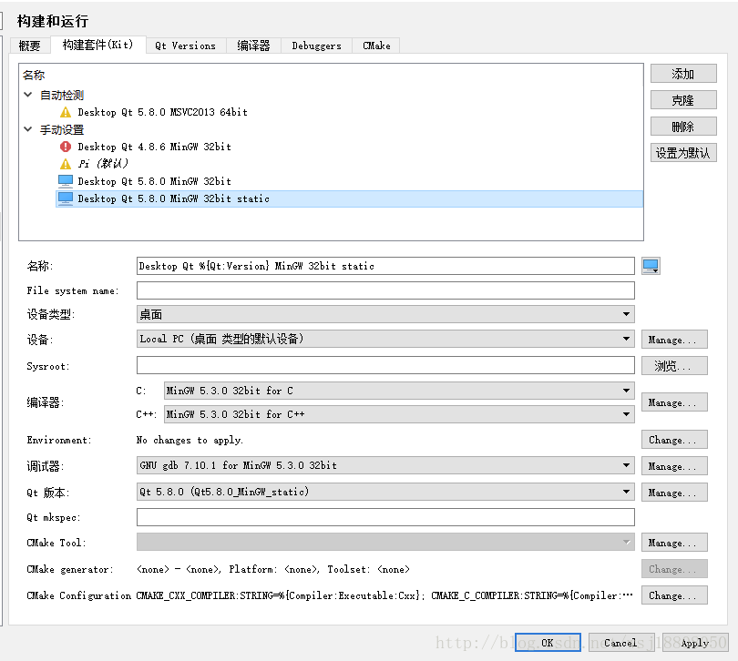

# Qt 静态编译

1.  官网下载 5.8 的包,源码https://pan.baidu.com/s/1bpgkTnp
2.  安装 mingw
3.  解压 static 包到 c:\qt 下,解压 OpenSSL 的 zip 压缩包（openssl-1.0.1c_static_w32_mingw.zip）到 C:\Dev
4.  打开 QtCreator 选择上方工具栏中的 -> 工具 -> 选项 -> 构建和运行
5.  在上方选项卡中选择 Qt Versions，并且点击右侧的添加
6.  打开 qmake.exe，路径是：C:\Qt\Qt5.8.0_MinGW_static\bin\qmake.exe
7.  
8.  构件套件(kit)中配置一个新的套件,上面的要点应用.
9.  
10. 然后 release 吧~

# Qt 下的 QString 与数字的相互转化

## 把 QString 转换为 double 类型

### 方法 1.QString str="123.45";

    double val=str.toDouble(); //val=123.45

### 方法 2.很适合科学计数法形式转换

    bool ok;

    double d;

    d=QString("1234.56e-02").toDouble(&ok); //ok=true;d;12.3456.

### 把 QString 转换为 float 形

    1.QString str="123.45";

    float d=str.toFloat(); //d=123.45

    2.QString str="R2D2";

    bool ok;

    float d=str.toFloat(&ok); //转换是被时返回0.0,ok=false;

## 把 QString 形转换为整形

### 1.转换为十进制整形

注意：基数默认为 10。当基数为 10 时，并且基数必须在 2 到 36 之

间。如果基数为 0，若字符串是以 0x 开头的就会转换为 16 进制，若以 0 开头就转换为八进制，否则就转换为十进制。

    Qstring str="FF";

    bool ok;

    int dec=str.toInt(&ok,10); //dec=255 ; ok=rue

    int hex =str.toInt(&ok,16); //hex=255;ok=true;

## 3.常整形转换为 Qstring 形

    long a =63;
    QString str=QString::number(a,16); //str="3f";
    QString str=QString::number(a,16).toUpper(); //str="3F";

### Qstring 转换 char\*问题

#### 方法一:

    QString qstr("hello,word");
    const char * p = qstr.toLocal8Bit().data();

#### 方法二:

    const char \*p = qstr.toStdString().data();
    转换过来的是常量

## 把当前时间转化为 QString...

    public QDateTime qdate = QDateTime.currentDateTime();
    datetime = qdate.toString("yyyy年MM月dd日ddddhh:mm:ss");
    如果不是QTime和QDate类比如说：通过TCP/IP接收到的char unsigned char 类等如何转换为QString类
    QString Time2String( DWORD dwTime)
    {
        char cTime[50] = {0};
        memset(cTime,0,50);
        strftime(cTime,32,"%Y-%m-%d %H:%M:%S",localtime(&time_t(dwTime)));
        return QString(cTime);
    }

# Qt 图片处理

## 显示图片

```cpp
    QString filename;
    filename=QFileDialog::getOpenFileName(this,tr("选择图像"),"",tr("Images (*.png *.bmp *.jpg *.tif *.GIF )"));
    if(filename.isEmpty())
    {
         return;
    }
    else
    {
        QImage* img=new QImage;

        if(! ( img->load(filename) ) ) //加载图像
        {
            QMessageBox::information(this,
                                     tr("打开图像失败"),
                                     tr("打开图像失败!"));
            delete img;
            return;
        }
        ui->label->setPixmap(QPixmap::fromImage(*img));
    }
```

## 图片缩放

图像缩放采用 scaled 函数。函数原型

```cpp
QImage QImage::scaled ( const QSize & size,Qt::AspectRatioMode aspectRatioMode = Qt::IgnoreAspectRatio, Qt::TransformationModetransformMode = Qt::FastTransformation ) const
//使用方法如下，还是利用上面的img：

QImage* imgScaled = new QImage；
*imgScaled=img->scaled(width,
                       height,
                       Qt::KeepAspectRatio);
ui->label->setPixmap(QPixmap::fromImage(*imgScaled));
```

## 图片旋转

```cpp
QImage* imgRatate = new QImage;
QMatrix matrix;
matrix.rotate(270);
*imgRotate = img->transformed(matrix);
ui->label->setPixmap(QPixmap::fromImage(*imgRotate));
```
