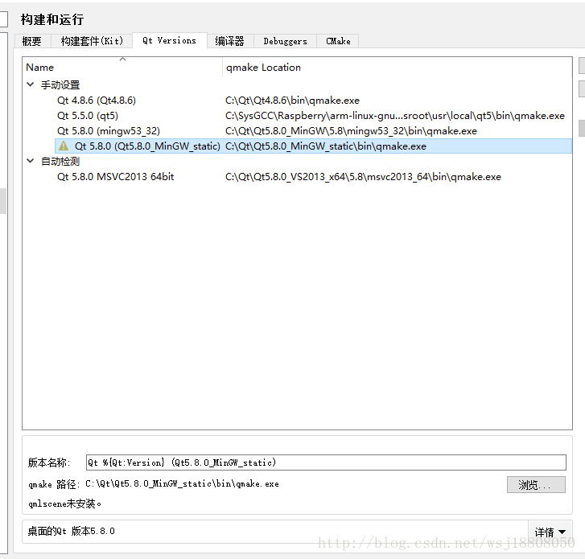

[TOC]

# 杂项
* wchar_t 扩展字符集，cin和cout将输入输出看作是char流，因此不适用处理wchar_ t类型，通过前缀L指示宽字符常量和宽字符串。     

> c和c++对有效位数要求是，float至少32位，double至少是48位，切不少于float。long
> double至少和double一样多，这三种类型的有效位数可以一样多。通常float为32位，double为64位，long double为80 96 128位。这三种指数类型至少是-37到37，可以从cfloat或float.h找到系统的限制。    
 
 *wchar_t a[] = L"字符串”;    
 *char16_t a[] = u"字符串”;    
 *char32_t a[] = U"字符串";     
 *cout<<R“(原始字符串)”;    
 *c++11 结构可以用列表初始化;    
 *{}列表初始化，不允许缩窄，变量。
 *（c++11）     
 *关键字auto可以不指定变量的类型      
 *cin.getline(name,int);
 *读取一行的输入。丢弃换行符
 *cin.get(name,int);读取一行，留下换行符。     
 *cin.get()读取单个字符；    
 *cin.clear();清除失效位（failbit）；     
 *前缀R表示raw原始字符串，此时\n不表示换行符；
 
 结构数组初始化: 

```cpp
    struct a;         
    a b[2] =      
    {  {"a",1,32.3} 
    {...}    
     };
```

# 位操作
     对一个二进制补码数取相反数，反转每一位，然后再加1.
     二进制计数法只能精确的表示多个1/2的幂的和。  

* `~`按位取反，
* `&`只有两个操作数对应为1才为1 
* `|` 任意操作数为1，那么结果就为1  
* `^`位异或，如果操作数中的对应位有一个为1，但不都未1，那么结果为1


# Qt静态编译
 1. 官网下载5.8的包,源码https://pan.baidu.com/s/1bpgkTnp
 2. 安装mingw
 3. 解压static包到c:\qt下,解压OpenSSL的zip压缩包（openssl-1.0.1c_static_w32_mingw.zip）到 C:\Dev
 4. 打开QtCreator选择上方工具栏中的 -> 工具 -> 选项 -> 构建和运行
 5. 在上方选项卡中选择 Qt Versions，并且点击右侧的添加
 6. 打开qmake.exe，路径是：C:\Qt\Qt5.8.0_MinGW_static\bin\qmake.exe 
 7. 
 8. 构件套件(kit)中配置一个新的套件,上面的要点应用.
 9. 
 10. 然后release吧~

# Qt下的QString与数字的相互转化  

## 把QString转换为 double类型

### 方法1.QString str="123.45";


    double val=str.toDouble(); //val=123.45

### 方法2.很适合科学计数法形式转换

    bool ok;

    double d;

    d=QString("1234.56e-02").toDouble(&ok); //ok=true;d;12.3456.

### 把QString转换为float形

    1.QString str="123.45";

    float d=str.toFloat(); //d=123.45

    2.QString str="R2D2";

    bool ok;

    float d=str.toFloat(&ok); //转换是被时返回0.0,ok=false;

## 把QString形转换为整形

### 1.转换为十进制整形

注意：基数默认为10。当基数为10时，并且基数必须在2到36之

间。如果基数为0，若字符串是以0x开头的就会转换为16进制，若以0开头就转换为八进制，否则就转换为十进制。

    Qstring str="FF";

    bool ok;

    int dec=str.toInt(&ok,10); //dec=255 ; ok=rue

    int hex =str.toInt(&ok,16); //hex=255;ok=true;

## 3.常整形转换为Qstring形

    long a =63;
    QString str=QString::number(a,16); //str="3f";
    QString str=QString::number(a,16).toUpper(); //str="3F";

### Qstring 转换char\*问题
#### 方法一:
    QString qstr("hello,word");
    const char * p = qstr.toLocal8Bit().data();
#### 方法二:
    const char \*p = qstr.toStdString().data();
    转换过来的是常量


## 把当前时间转化为QString...
    public QDateTime qdate = QDateTime.currentDateTime();
    datetime = qdate.toString("yyyy年MM月dd日ddddhh:mm:ss");
    如果不是QTime和QDate类比如说：通过TCP/IP接收到的char unsigned char 类等如何转换为QString类
    QString Time2String( DWORD dwTime)
    {
        char cTime[50] = {0};
        memset(cTime,0,50);
        strftime(cTime,32,"%Y-%m-%d %H:%M:%S",localtime(&time_t(dwTime)));
        return QString(cTime);
    }

## gcc编译

1.使用gcc生成静态库及静态库使用方法：

　　在此例中，test.c用于编译生成静态库libtest.a，test.h为libtest.a对应的头文件。

　　第一步：生成test.o目标文件，使用gcc -c test.c -o test.o命令。

　　第二步：使用ar将test.o打包成libtest.a静态库，使用ar rcs -o libtest.a test.o命令

　　第三步：生成libtest.a静态库后，可以使用命令ar t libtest.a查看libtest.a文件中包含哪些文件。

　　第四步：编译main.c，并使用libtest.a静态库，链接时-l参数后不加空格指定所需要链接的库，这里库名是libtest.a，但是只需要给出-ltest即可，ld会以libtest作为库的实际名字。完整的命令为：gcc -o app_static main.c -L. -ltest 或者是gcc -o app_static main.c libtest.a

　　第五步：运行app_static

　　直接使用命令./app_static

　　2.使用gcc生成动态库及使用动态库的方法

　　第一步：生成test.o目标文件，使用如下命令。在此处需要添加-fPIC参数，该参数用于生成位置无关代码已工生成动态库使用，使用命令：gcc -c -o test.o -fPIC test.c

　　第二步：使用-shared参数生成动态库，使用如下命令：gcc -shared -o libmyshare.so test.o,上述两个命令可以连在一起，如下所示：gcc -shared -fPIC -o libmyshare.so test.c

　　第三步：编译main.c，使用libmyshare.so动态库，命令如下gcc -o app_share main.c -L. -lmyshare.使用ldd app_share命令查看app_share使用动态库，如果libmyshare无法找到，直接执行app_share就会出现错误。解决方法：首先使用export LD_LIBRARY_PATH=.:$LD_LIBRARY_PATH将当前目录加入LD_LIBRARY_PATH变量中。再次运行ldd app_share

　　另一种编译main.c，并链接libmyshare.so的方式如下（该方式通过./libmyshare.so直接指定使用当前目录下的libmyshare.so文件），使用命令：gcc -o app_share main.c ./libmyshare.so

## 动态链接库

### c

```c
//导出函数接口，dll中可以调用
    _declspec(dllexport) void go() //export method,call in load
    {
        int a = 2;
    }
```

## 前向声明 forward declaration

前向声明是一种，不完全类型声明，所以他并不能取代完全类型，对于编译器来说，在需要知其被声明对象大小和内容时，前向声明，己不可用。故其应用场景，仅限如下：

*   1，声明引用和指针
*   2，作函数(仅声明)，的返回类型或是参数类型。

下面给出了一个应用场景： 
A.h

```cpp
#ifndef __A__H__
#define __A__H__

#include <string>
class B;  // here is the forward declaration

class A {
public:
  B getBfromA();
  std::string who_are_you();

};
#endif
```

B.h

```cpp
#ifndef __B__H__
#define __B__H__

#include <string>

class A;  // Here is the forward declaration

class B {
public:
  A getAfromB();
  std::string who_are_you();
};

#endif
```

A.cpp

```cpp
#include "A.h"
#include "B.h"

B A::getBfromA() {
  return B();
}

std::string A::who_are_you() {
  return "I am A";
}
```

B.cpp

```cpp
#include "B.h"
#include "A.h"

A B::getAfromB() {
  return A();
}
std::string B::who_are_you() {
  return "I am B";
}
```

main.cpp

```cpp
#include "A.h"
#include "B.h"

#include <iostream>

int main() {
  A a;
  B b;

  A ab = b.getAfromB();
  B ba = a.getBfromA();

  std::cout << "ab is: " << ab.who_are_you() << endl;
  std::cout << "ba is: " << ba.who_are_you() << endl;

  return 0;
}
```
