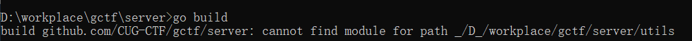
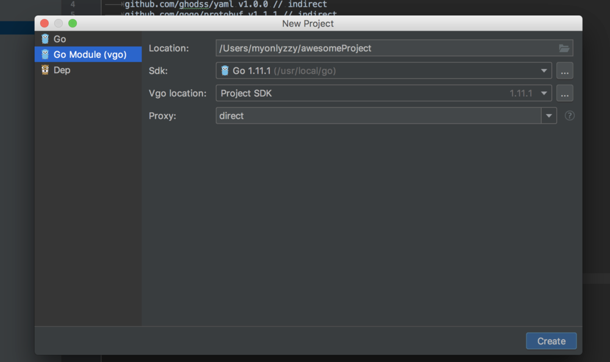

## go坑爹的包管理
首先StackOverflow、github-issue是个好东西，比百度强`1<<31`倍
如果你的项目不在gopath中，源代码里使用了相对路径导入`import "./model"` 可能就会编译失败，goland貌似会把你的工程目录添加进gopath中，这样就可以使用相对路径导入，不过不建议这么做。正确的做法应该是`github.com/xxx/xxx` 然后在gopath下开发就行，当然github.com也是可以替换掉的。

在go1.11以后，使用了全新的go module管理方式

## go mod
官方文档:https://github.com/golang/go/wiki/Modules  
教程:https://roberto.selbach.ca/intro-to-go-modules/  
go在1.11.1以上添加了go mod特性，用来取代以前的依赖管理。在Goland新建选项的时候选择第二个Go module

默认环境变量GO111MODULE=auto, 若工程在gopath下，就会从gopath寻找依赖包，或者从vendor中寻找依赖，在外部路径就会使用go module特性。

### 使用

     go mod init   
这个会初始化go.mod文件，如果你没有.git目录，或则和他不能判断你的module paht，你就需要再额外输入个名字，然后你就可以直接build了，他会自动填充go.mod文件,
```
module github.com/CUG-CTF/gctf/server

go 1.12

require (
	cloud.google.com/go v0.37.1 // indirect
	github.com/fsouza/go-dockerclient v1.3.6
	github.com/gin-contrib/cors v0.0.0-20190301062745-f9e10995c85a
	github.com/gin-gonic/gin v1.3.0
	github.com/go-xorm/core v0.6.2
	github.com/go-xorm/xorm v0.7.1
	github.com/lib/pq v1.0.0
	golang.org/x/crypto v0.0.0-20190313024323-a1f597ede03a
)

```
第一行定义了module名，前面说到，用相对路径会导致编译失败，如果使用了`go mod` 那么你就可以不再依赖GOPATH，以上述module为例，假设你的module的名字为 `github.com/CUG-CTF/gctf/server`，那么你在代码里导入就可以直接使用`import " github.com/CUG-CTF/gctf/server/module"`，并且可以顺利编译通过。

    go get foo@lastest
    go get foo
    go get -u foo
前两行的包升级方式是一样的，加上-u 参数会更新foo的依赖项和间接依赖项，
前两行升级指挥升级bug fix版本，(1.0.0->1.0.1)并不会升级大版本
### 版本号语义化
[自己看吧](https://github.com/golang/go/wiki/Modules#semantic-import-versioning) 版本号是有规定的，一般使用`git tag`，除了格式要求，还有语义要求
### vendor
go module 默认忽略vendor目录的，当然如果要添加vendor依赖，可以使用`go mod vendor`创建一个vendor目录，并且拷贝所有依赖进去，同时build的时候也要使用`bo build -mod vendor`
建议开发时用go build,zai CI时使用`vendor`，因为CI过程中不一定有外网环境
## go proxy
有了go mod特性，可以使用`go proxy`来代理go mod，只需要设置环境变量即可`GOPROXY = "https://goproxy.io"` 更多请看：https://goproxy.io/

