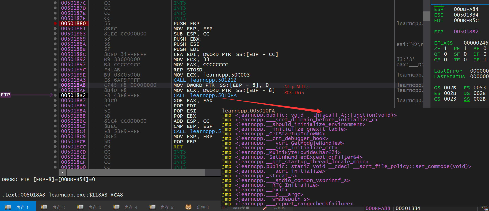

## cloud docker nginx

https://zhuanlan.zhihu.com/p/95255564

## 要复习的

- 进程和线程的区别和其使用等
- 智能指针
- 中序遍历的非递归写法
- 多线程的同步方法和如何使用
-     - 锁- 中断- 信号量- 原子操作- ..
- 进程间通信的方法，还有它和 socket 通信的相同和不同点- 在哪儿
- 管道- 消息- 共享文件-unix:///.sock
- linux 的进程间通信和 windows
- malloc 和 alloc 的区别
- vector 何时进行空间的搬运
- 大批量对象的搬运进行了怎样的优化
- placement new 和 operator new 的不同表现
- 要 vector 的新空间为 2 倍
- 操作系统的页和操作系统对进程的内存分配方式还有段页- 的情况

```cpp
//运行结果，汇编代码
class A {
public:
    void f1() {}
    virtual void f2() {}
}
A* a = nullptr;
a->f1();
a->f2();
```


拥塞避免算法、操作系统的 LRU、如何对反爬虫机制进行破解、判断一棵二叉树是不是二叉搜索树、嵌套数组的环形遍历、乐观锁和悲观锁有啥区别、求二叉树是否存在和为 N 的路径、针对每个连接维护一个线程，开销很大，如何优化、有一个单链表，奇数位是升序的，偶数位是降序的，要求进行给它进行排序 1->200->10->120->30->8->88->4、中断实现机制，软硬中断的区别、redis 线程模型、topk 问题、聚集索引，非聚集索引、http2

### 将一棵二叉搜索树转换成双向链表

https://blog.csdn.net/zengzhen_csdn/article/details/51198530

### 红黑树

https://www.jianshu.com/p/0b68b992f688

## 安天

1. 常见的数据结构都有哪些，set 的实现原理
2. 静态分析工具的使用
3. 样本分析

## 腾讯

硬件断点、软件断点、单步原理。调试器原理。反调试手法、SEH、VEH，异常处理,CE 原理。虚函数继承虚表变化。

## 头条 安全

1. Linux 基本命令、xargs，mysql 花式索引，https/SSL ，证书原理、输入 url 点击后背后发生的事，同源策略，xss，csrf，tcp/ip，arp、icmp、go 语言数组和 slice 区别与坑

2. pe 文件结构，hook 原理，windows 函数调用，linux 函数调用，windows，linux 系统调用原理。windows 漏洞利用，rop，aslr 绕过，内核漏洞利用。linux 漏洞利用，linux 堆栈漏洞，ctf 经历，内核漏洞利用，内核保护原理，写一道简单算法，2 道汇编，一道函数调用汇编，一道汇编实现 memcpy, hook 原理

3) xss 防范，fuzz

## 360 企业安全

sql 注入类型，判断注入，原理，手写 payload(时序)，防护，mysql、oracle、sqlserver 注入区别，上传所有绕过方法，原理，解析漏洞，逻辑漏洞，XSS 类型，绕过技巧，防护，过滤'<'等还可以 XSS 吗？Java 三大框架，序列化/反序列化，OSI 七层，sqlmap 各种命令，https 注入参数，payload 回显参数，nmap 扫描存活，waf 绕过，双编码绕过，nmap 原理，判断存活方法,2345xx http 状态吗

## 防御方

sql 注入类型，防护，
mysql,oracle TiDB mongoDB,Couch 注入防护，加固
上传绕过方法，原理，防御
解析漏洞，逻辑漏洞原理，
xss 类型，绕过技巧，如何防御
Java 三大框架
php，序列化反序列化原理，防御
OSI 七层模型，
TCP syn floor 原理
nmap 扫描防御
http 状态吗，500 502 403 405 401 400 204
重放攻击防御
SSL、TLS 是什么
如何配置 https 证书


## 某次面试
```
网鼎杯名次
维吉尼亚密码 原理
des密钥长度 64位 使用56位
模反元素 乘法逆元 方法
欧拉函数是干嘛的
对于明文m和N是否要求互质
什么是离散对数问题
什么是有限域
数字签名怎么解决伪造的问题
sql注入中，报错注入怎么做的，什么原理
xss过滤了scrip和尖括号
bp怎么抓https的包
nmap设置速率--max-rate  -sS参数原理
php反序列化原理
csrf的危害
ssrf是什么
文件上传绕过原理
```

## web安全
简单介绍一下你的技术情况。

如果让你渗透一个网站，你的思路是什么。

说一些近段时间你了解的漏洞。

以前挖过哪些网站的漏洞。

说几个你比较常用的工具。

25、23、22、3306、1433、7001、445、139端口都是哪些服务的端口。

SQL注入漏洞的原理。

反序列化漏洞的原理。

如何去测试SQL注入/反序列化/XSS/文件上传/越权...漏洞。

xxe漏洞的原理。

文件上传漏洞的绕过方法有哪些。

SQL注入漏洞有哪些利用手法。

比较喜欢用哪几种工具，它们的优势是什么。

CSRF漏洞的原理。

SQL注入、反序列化、文件包含、文件上传、CSRF、XSS、XXE漏洞的修复方法。

如果网站有CDN，你如何查看他的真实IP地址。

文件上传的时候如何突破前端后缀验证。

sql注入的报错函数，延时注入的函数？

你有什么自己的思路吗关于文件上传

你参加过哪些项目

sqlmap怎么提权

说几个提权漏洞

你了解spring框架漏洞吗

常见的基于php的cms的漏洞

绕WAF可以尝试哪些手段

后渗透怎么做权限维持？讲一下后渗透吧。

内网渗透横向移动怎么实现？

说一下你最难忘的挖洞经历？

如何判断是否有CDN。

内网黄金票据、白银票据的区别和利用方式？

UDF提权原理？

Windows cmd 如何下载文件？

常见提权方式？

Nmap 全端口扫描命令是什么。

mysql写shell，如果不知道网站绝对路径，我们通过什么方式可以知道网站路径。

Nmap 全端口扫描命令是什么。

SSRF 禁用 127.0.0.1 后如何绕过，支持哪些协议？

如果服务器被入侵，你会怎样进行溯源。

常见的中间件解析漏洞有哪些。

在Windows/linux的加固问题上，你有哪些方法。

服务器上面有mysql数据库，但是在外网探测端口的时候扫不到服务端口，为什么？

说几个你熟悉的存在漏洞的中间件。

习惯性的查看页面源代码有什么作用。

linux服务器被植入后门了，讲一下你的排查流程。

说几个php里面可以执行命令的函数。

Sql 注入无回显的情况下，利用 DNSlog，mysql 下利用什么构造代码，mssql 下又如何？

已知某网站存在nignx解析漏洞且用户页面可上传头像，如何getshell。

做过免杀吗，现在主要的免杀手段是什么。

怎么查找域控。

XSS， CSRF， CRLF ⽐较容易弄混，说说三者的原理，防御⽅法。


