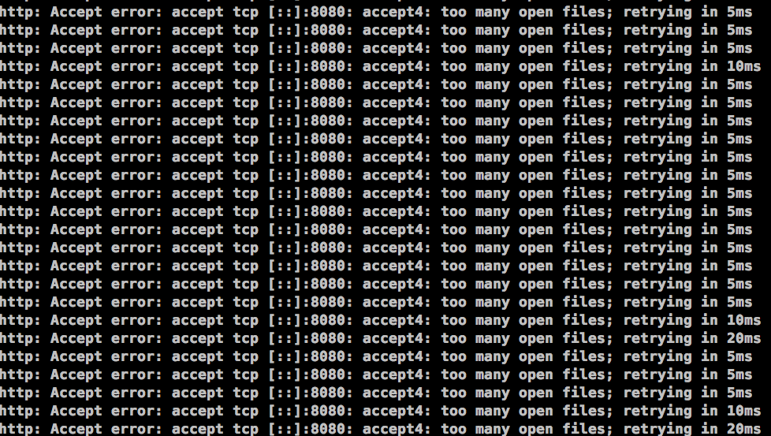

# 性能优化
- 关闭防火墙(iptables selinux)
- 检查开机启动项
- 调整文件描述符限制
    1. vim /etc/security/limits.conf
        写入`*  - nofile 65535`
    2. ulimit -SHn 65535 加入/etc/rc.local


37.47
## network
监控工具 dstat -n -N lo
```conf
fs.file-max = 1000000
fs.inotify.max_user_instances = 8192
net.core.netdev_max_backlog = 65536
net.core.optmem_max = 65536 
net.core.rmem_default = 8388608
net.core.wmem_default = 8388608
net.core.rmem_max = 16777216
net.core.wmem_max = 16777216
net.core.somaxconn = 32768
net.ipv4.tcp_fin_timeout = 15
net.ipv4.tcp_slow_start_after_idle = 0
net.ipv4.tcp_max_tw_buckets = 65536
net.ipv4.tcp_tw_reuse = 1
net.ipv4.tcp_window_scaling = 1
net.ipv4.tcp_keepalive_time = 60
net.ipv4.tcp_keepalive_intvl = 10
net.ipv4.tcp_keepalive_probes = 6
net.ipv4.tcp_max_syn_backlog = 65536
net.ipv4.tcp_rmem = 4096 87380 16777216
net.ipv4.tcp_wmem = 4096 65536 16777216
net.ipv4.udp_rmem_min = 16384
net.ipv4.udp_wmem_min = 16384
net.ipv4.ip_local_port_range = 1024  65535
net.core.default_qdisc = fq
net.ipv4.tcp_congestion_control = bbr


```




## mysql
更改最大连接数
