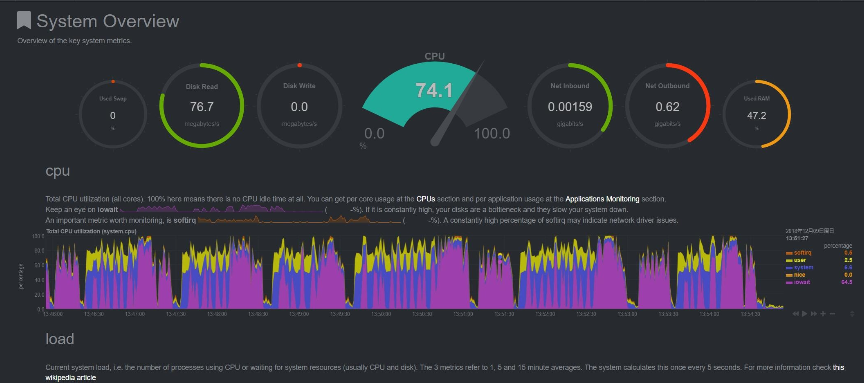
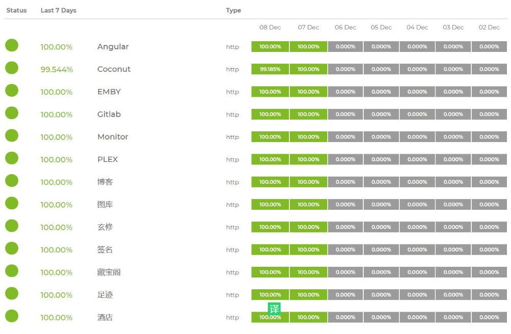

## bbr
 https://github.com/teddysun/across/raw/master/bbr.sh
## docker 常用容器
### mssql
```sh
# 注意，PASSWORD必须足够复杂，否则会报错
docker run -e 'ACCEPT_EULA=Y' -e 'SA_PASSWORD=Str0ngPassword!' -p 1433:1433 -d microsoft/mssql-server-linux
```
### postgresql
```sh
docker run -d  -p 5432:5432 -e POSTGRES_PASSWORD=mysecretpassword  postgres 
```


```sh
docker run -it --rm postgres psql -h host -U postgres
```

### mysql
docker run -d --name yp_gis_mysql -p 3306:3306 -v /data/yp_gis_mysql/:/var/lib/mysql -e MYSQL_ROOT_PASSWORD=mysql_password mysql --character-set-server=utf8mb4 --collation-server=utf8mb4_unicode_ci
### pmm

```bash
# 拉取服务器镜像

docker pull percona/pmm-server:latest

# 创建PMM数据容器

docker create \
   -v /opt/prometheus/data \
   -v /opt/consul-data \
   -v /var/lib/mysql \
   -v /var/lib/grafana \
   --name pmm-data \
   percona/pmm-server:latest /bin/true

# 创建PMM服务器容器, 同时设置登录用户名(SERVER_USER)和密码(SERVER_PASSWORD), 根据需要进行修改. 默认使用80端口, 如果需要可以更改.

docker run -d -p 9001:80 \
  --volumes-from pmm-data \
  --name pmm-server \
  -e SERVER_USER=test \
  -e SERVER_PASSWORD=test \
  --restart always \
  percona/pmm-server:latest
```

## 运维常用服务
* 日志收集graylog
* 客户端收集:fluentd
* 阿里云 logsearch
* 自定义nginx日志字段
* 网络质量：smokeping
* gitlab
* seafile
## 各种监控
### 流量监控
[matomo和piwik](https://www.bboysoul.com/2018/03/12/matomo%E7%9A%84%E5%AE%89%E8%A3%85%E4%BD%BF%E7%94%A8%E5%92%8C%E4%BD%93%E9%AA%8C/)

### CPU、内存 单机监控
NetData

### 服务心跳
uptimeRobot


## nfs
解决`nfsd: sent only 253344 when sending 1040772 bytes - shutting down socket` 问题
### 重新挂载
```sh
mount -t nfs -o soft -o nolock -o intr xx.xx.xx.xx:/oneT/file.cugapp.com.seafile-data /nfs/seafile-data-nfs/
```
### 更改相关配置
- 网卡最大传输队列
```sh
ip link set ib0 txqueuelen 10000
```
- 更改内核配置


## openshift
很nb的一个PaaS工具
https://github.com/openshift/origin
https://blog.csdn.net/wh211212/article/details/80539083
https://docs.openshift.com/online/getting_started/index.html

## 镜像站配置&&搭建
https://ring0.me/2013/09/how-ustc-mirror-works/  
http://fangpeishi.github.io/build_opensource_mirror.html  
https://www.zhihu.com/question/19719790  