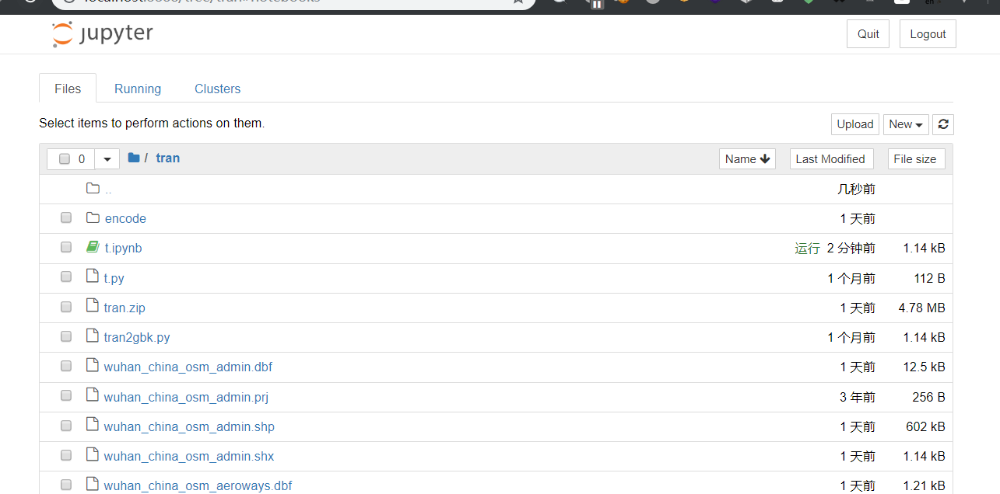

## format 函数

```py
print('{名字}今天{动作}'.format(名字='陈某某',动作='拍视频'))#通关键字
grade = {'name' : '陈某某', 'fenshu': '59'}
print('{name}电工考了{fenshu}'.format(**grade))#通过关键字，可字典当关键字传入值时，在字典前加**即可

#通过位置
print('{1}今天{0}'.format('拍视频','陈某某'))#通过位置
print('{0}今天{1}'.format('陈某某','拍视频'))

#精度和类型f精度常和f一起使用
print('{:.1f}'.format(4.234324525254))
print('{:.4f}'.format(4.1))
#进制转化，b o d x 分别表示二、八、十、十六进制
print('{:b}'.format(250))
print('{:o}'.format(250))
print('{:d}'.format(250))
print('{:x}'.format(250))

#千分位分隔符，这种情况只针对与数字
print('{:,}'.format(100000000))
print('{:,}'.format(235445.234235))
```

## bytes&&string on py3

```py
s = str(codecs.decode('16ff00', 'hex'))
# s: b'\\x16\\xff\\x00'
codecs.decode('16 ff00', 'hex')
# error!
hex_string = """ 16 03 02 """
some_bytes = bytes.fromhex(hex_string)
# some_bytes: b'\x16\x03\x02'
some_bytes = bytearray.fromhex(hex_string)
# some_bytes: bytearray(b'\x16\x03\x02')

## int转byte、str
u=[1635017059,1953724780,1868915551]
username=''
for x in u:
    username+=x.to_bytes(4).decode()
print(username)

### hex转换float,float转hex
def float2hex(s):
    fp = ctypes.pointer(ctypes.c_float(s))
    cp = ctypes.cast(fp,ctypes.POINTER(ctypes.c_long))
    return hex(cp.contents.value)

def hex2float(h):
    i = int(h,16)
    cp = ctypes.pointer(ctypes.c_int(i))
    fp = ctypes.cast(cp,ctypes.POINTER(ctypes.c_float))
    return fp.contents.value
```

## multiprocessing

不被 GIL 锁限制，直接跑满 cpu

```py
import multiprocessing
import time

def func(msg):
    for i in xrange(3):
        print msg
        time.sleep(1)
    return "done " + msg

if __name__ == "__main__":
    pool = multiprocessing.Pool(processes=4)
    result = []
    for i in xrange(10):
        msg = "hello %d" %(i)
        result.append(pool.apply_async(func, (msg, )))
    pool.close()
    pool.join()
    for res in result:
        print res.get()
    print "Sub-process(es) done."
```

windows 下可能会崩溃的话，添加`multiprocessing.freeze_support()`

## jupyter

这个东西会装上 ipython，可以开启一个浏览器进行多人协作写 py。

**安装：** https://jupyter.readthedocs.io/en/latest/install.html

## 各种小玩意

### 查看当前环境

````
```python
import sys
print('\n'.join(sys.path))
````

### Mac OS X 上如何切换默认的 Python 版本

https://www.zhihu.com/question/30941329

### shellcode 检测

pylibemu

### 各种库

1. distorm3 反编译引擎 pip 安装
2. [Impacket](https://www.freebuf.com/sectool/175208.html) 低级网络编程，支持各种协议

### pyv8

js 处理，google 出品，macos 安装

[](https://github.com/emmetio/pyv8-binaries/)

```bash
cd pyv8 //进入解压后的目录
sudo cp * /Library/Python/2.7/site-packages/
/usr/local/lib/python3.6/site-packages
```

### libemu

shellcode 检测工具 preepdf 依赖之一
https://github.com/buffer/libemu
aclocal
autoreconf -v -i
./configure --prefix=/opt/libemu;  
sudo make install
pip3 install pylibemu