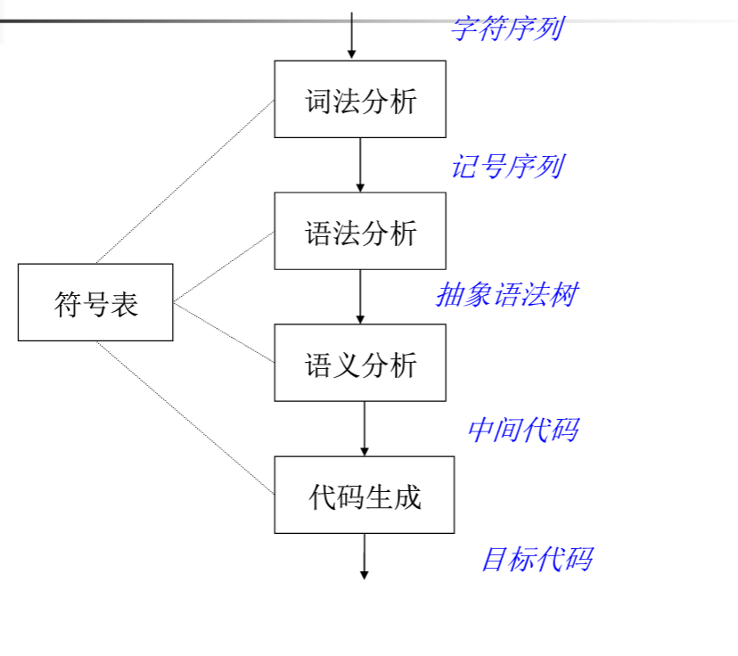

# 概述

架构：

- 前端：
    - 词法分析 处理字符序列，字符流-> 记号流
    - 语法分析 检查语法，建立抽象语法树
    - 语义分析 程序ok，生成中间代码，ssa，三地址代码
- 后端
    - 指令生成 生成目标代码
    - 优化

一种没有优化的编译器结构：

更复杂的编译器架构

比那一起可以堪称多个阶段构成的流水线结构，
原因：
高级语言复杂
模块分离
容易实现
容易维护
设计问题：
接口清新
容易实现，维护
保证结合行

## 词法分析器任务

从字符流到记号流
字符:源代码
记号: 编译器内部数据结构，词法单元

实现方法:
- 手工编码
    - 复杂，容易出错
    - LLVM GCC实现方式
- 生成器
    - 快速原型，代码量少
    - 难控制细节 

## 声明式规范-正则表达式
正则表达式-> 自动机

# 文法
## 0型文法
设G=(Vn,Vt,P,S),若果它的每个产生式α→β是这样的一种建构：a∈(Vn∪Vt)*，且至少含有一个`非终结符`而β∈(V
n∪Vt),则G是一个0型文法，也称`短语文法`。处理能力相当于图灵机，并且递归可枚举。

## 1型文法
也叫`上下文有关文法`,对应线性有界自动机。在0型文法基础上每一个α→β都有|β|>=|α|，有一个特例，a→ ，也满足1型文法

## 2型文法
也叫`上下文无关文法`,对于下推自动机。在1型文法中满足每一个α→β都有α是费终结符

## 3型文法
也叫`正规文法`，对应`有限状态自动机`,在2型文法的基础上满足A→α|αB(右线性)或A→α|Bα(左线性)