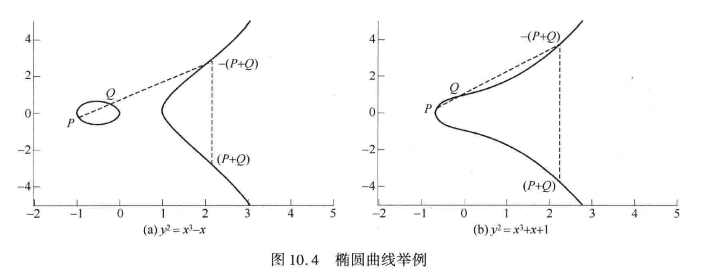

## 椭圆曲线
椭圆曲线并不是椭圆，一般情况下椭圆曲线的三次方程形式为$y^2+axy+by=x^3+cx^2+dx+e$。

我们用到的是$y^2=x^3+ax+b$，图像大致如下

//todo
https://weichujian.github.io/2020/05/27/Ecc%E6%A4%AD%E5%9C%86%E6%9B%B2%E7%BA%BF%E5%9F%BA%E7%A1%80/
https://www.zhihu.com/column/datacruiser
https://zhuanlan.zhihu.com/p/102807398
https://zhuanlan.zhihu.com/p/104531745