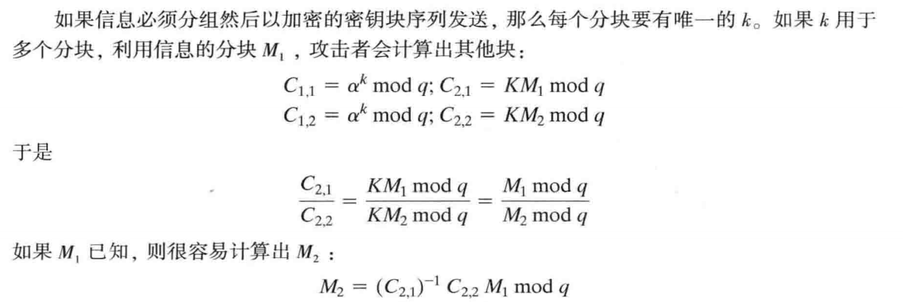

## 算法
### 公私钥生成
使用了离散对数困难问题的加密算法。
1. 选择一个素数q,$\alpha$是q的素根。
2. 随机生成一个整数$X_A$,使得$1<X_a<q-1$
3. 计算$Y_A=\alpha^{X_A}\mod q$
4. A的私钥位$X_A$,公钥为q,$\alpha,Y_a$。
### 加密
1. 讲信息表示为一个整数M，其中$1\leq M \leq q-1$，以分组密码序列的方式发送信息。
2. 选择任意整数k,使得$1\leq k \leq q-1$.
3. 计算一次密钥 $K=Y_A^k \mod q$
4. 将M加密成密文对$(C1,C2),C_1=\alpha ^k \mod q;C_2=KM \mod q$

### 解密
1. 计算出$K=(C_1)^{X_A} \mod q$
2. 计算$M=(C_2 K^{-1}) \mod q$

### 攻击
如果k用于多个分块，则知道一个分块即可计算出其他块。
