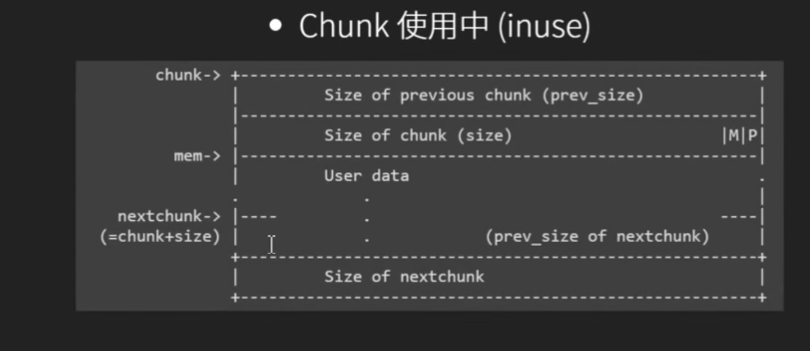

## 堆数据结构
- 存放chunk的metadata的chunk的结构(header)
```c
struct malloc_chunk{
    size_t prev_size; //qword 可能存放上一个chunk的data
    size_t size;//qword
    malloc_chunk *fd;
    malloc_chunk *bk;
    malloc_chunk *fd_nextsize;
    malloc_chunk *bk_nextsize;
}
```
使用中的chunk

mem=malloc(size)
- chunk = mem-16;
- chunksize = (size+8)#16
- chunk的地址是malloc得到的地址-16
- chunksize是size+8向上对齐16的整数倍

## Fastbin
- Chunk size <= get_max_fast()的chunk，会被放在fastbin的bin里
- 64bit是128bytes，32bit是64bytes
- global_max_fast 一开始是0
- Fastbin是single linked list，只能使用fd，以NULL结尾
- Chuk Size从32开始，共7个可用的fastbin
- free的时候不会取消下一个chunk的prev_inuse_bit 因为fastbin chunk不会和其他chunk合并
- malloc和free会对chunk进行检查，但检查fastbin的很少