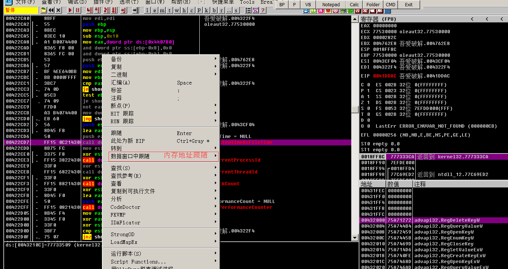

## 脱壳
1. 找到OEP
2. Dump镜像文件，修复镜像大小
3. 修复IAT
4. 修复重定位表，修复资源，vmoep等
## ESP定律
pushad后，ESP改变（OD中变红），数据窗口跟随，选中剩余数据，右键，硬件访问断点，执行， 运行到OEP，右键，od脱壳调试进程(HW esp)

    重建输入表和不重建输入表不同。

## 单步法
到oep停止。

## 两次断点(内存镜象法)
内存窗口rsrc，数据，输入表下断点，按shift+f9 ，内存窗口401000 text段 pe文件头下面的，下f2断点 shift+f9，f8单步到达oep

## 最后一次异常
调试设置中取消忽略异常，shift+f9运行的前一次，反汇编窗口跟随se处理程序，f2断点，shift+f9，取消断点 f8单步到oep

## sfx
选择这个，
然后重载，等。

## 跟踪
tc eip < sfx，输入表 非常慢，不推荐直接使用

# 找IAT
FSG:OEP的call 回车进入，

数据窗口找到表头，记录偏移地址，
IAT RVA =地址-基地址
大小，最后一个减去第一个地址

# 排查崩溃
od里取消忽略所有异常 ，运行

