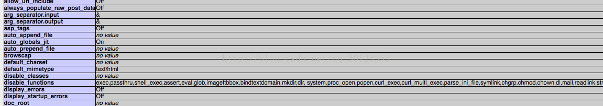

## php绕过扩展名
phpss

## 常用重要文件
/etc/apache2/apache2.conf
/etc/apache2/sites-enabled/000-default.conf
/var/log/apache2/error.log
## _FILES数组
$_FILES 数组提供了多个内容在文件上传时使用，比较重要的有以下几个：
```php
$_FILES['myFile']['name']// 客户端文件的原名称。 
$_FILES['myFile']['type']// 文件的 MIME 类型，需要浏览器提供该信息的支持，例如"image/gif"。 
$_FILES['myFile']['size'] //已上传文件的大小，单位为字节。 
$_FILES['myFile']['tmp_name'] //文件被上传后在服务端储存的临时文件名，一般是系统默认。可以在php.ini的upload_tmp_dir 指定，默认是/tmp目录。
```
上传过程中还利用到了一个重要的函数  `move_uploaded_file()`，该方法是将上传的文件移动到新位置，若不加上这一行代码，临时文件在上传周期后就被删除而不会被存储。

move_uploaded_file(file,newloc)
## 文件包含漏洞
　　服务器通过php的特性（函数）去包含任意文件时，由于要包含的这个文件来源过滤不严，从而可以去包含一个恶意文件，而我们可以构造这个恶意文件来达到邪恶的目的。
### 涉及到的危险函数
include(),require()和include_once(),require_once()
#### include
包含并运行指定文件，当包含外部文件发生错误时，系统给出警告，但整个php文件继续执行。
#### require
跟include唯一不同的是，当产生错误时候，include下面继续运行而require停止运行了。
#### include_once
这个函数跟include函数作用几乎相同，只是他在导入函数之前先检测下该文件是否被导入。如果已经执行一遍那么就不重复执行了。
#### require_once
这个函数跟require的区别 跟上面我所讲的include和include_once是一样的。所以我就不重复了


### 文件包含爆栈&上传
漏洞样例
```php
<?php
    include($_GET['c']);
?>
```
payload
```html
<html>
<meta charset="utf-8">
<body>
    <form name="upload" method="post" enctype="multipart/form-data" action="./self_include.php?c=self_include.php">
        File: <input type="file" name="file">
        <input type="submit" name="submit">
    </form>
</body>
</html>
```

#### 文件包含getshell
利用bp发包
`http://localhost:9000/<?php phpinfo();?>` 会被及记录到log/access.log
`http://localhost:9000/upload/self_include.php?c=../logs/access.log` 进行文件包含即可

#### 利用php /tmp临时文件上传shell
题目复现：[blog进阶](https://www.ichunqiu.com/battalion?t=1&r=56951)
php对post过来的文件有一个默认处理流程，即在一个处理周期内（post,response），首先将post过来的文件保存在/tmp文件夹下，
文件名为php{0-9A-Za-z}的随机字符，如果文件被php文件本身用到了，则php直接使用/tmp里的这个临时文件，如果没用到或者处理完毕了，则将/tmp下的这个临时文件删除。
也就是说，在正常处理流程下，tmp目录下的这个文件存活周期是一次请求到响应，响应过后，它就会被删除，因为kindeditor那里存在的目录遍历漏洞，导致我们可以查看tmp目录下的文件列表，我们也可以对任一php文件post一个文件过去，使其暂存于tmp目录下，问题就在于，我们还没来得及包含这个文件，它就会在这次请求结束后被删除掉。
如何不让它被删除掉呢？删除和处理请求的都是php，所以我们要让php守护进程产生内存溢出，换言之，使之崩溃，而php自身是不会因为错误直接退出的，它会清空自己的内存堆栈，以便从错误中恢复，这就保证了web服务的正常运转的同时，打断了php对临时文件的处理。
自包含恰巧可以做到这一点，什么是自包含呢？
即： `/X.php?include=X.php`
这样X.php就会将它本身包含进来，而被包含进来的X.php再次尝试处理url的包含请求时，又将自己包含进来一遍，这就形成了无穷递归，递归会导致爆栈，使php无法进行此次请求的后续处理，也就是无法删除/tmp目录中我们通过post强行上传的临时文件
整理下php对一个post文件请求的正常处理流程：
1.manager.php接收一个Post请求，php在/tmp目录下创建我们post的文件
2.manager.php处理请求url，包含一个文件
3.manager.php进行文件处理
4.php删除/tmp目录下的临时文件

整理下这个漏洞的触发过程：
1. manager.php接收一个Post请求，php在/tmp目录下创建我们post的文件
2.manager.php处理请求url，不断自包含本身造成内存溢出
3.php发出内存溢出信号，清空缓冲区和调用堆栈，以便接收新的请求
4./tmp目录下的上传文件得以保留
5.包含/tmp目录下的上传文件形成webshell

--------------------- 
作者：我好菜啊 
来源：CSDN 
原文：https://blog.csdn.net/qq_30123355/article/details/58165038 

## php伪协议

### 读取../flag.php
```
module=php://filter/read=convert.base64-encode/resource/../flag&name=php
```