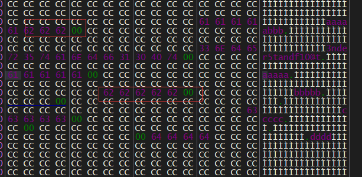

## 42
看题目名字猜一下，应该是去年发现的三个未知数的立方和=42问题。
根据字符串查找，来到这个地方

简单单步跟踪后，可以发现主要判断逻辑函数，意外获得了字符串'3nder5tandf10@t'，这个弹窗hooked不用管他。

通过SEH进行触发，由于属于SEH处理链，我没有找到好的方法通过ida进行F5，只能肉眼看汇编代码，配合调试追踪，调试后有两个发现：    
1.开头一定是f  
2.不一定是flag开头，任意`fxxx`都可以，但是第五位必须是{，这个check是可以f5的，除此之外还提取了{}的中间部分：

然后遇到第二个对flag中间部分的处理函数
## 分析对flag中间字符串的处理
这个处理过程是可以使用f5转化的，
```c
int __usercall middle_check@<eax>(char *source, char *flag_middle, int flag_middle_len, int a4)
{
  int v4; // xmm0_4
  int v5; // edx
  char *v6; // eax
  int v8; // [esp+D0h] [ebp-14h]
  int v9; // [esp+DCh] [ebp-8h]

  sub_41133E((int)&unk_424034);
  v9 = 0;
  v8 = 0;
  while ( v9 <= flag_middle_len - 1 )
  {
    if ( flag_middle[v9] == '-' )
    {
      source[0x28 * v8++ + v9++] = 0;
    }
    else if ( flag_middle[v9] != '-' )
    {
      if ( v8 )
      {
        switch ( v8 )
        {
          case 1:
            v5 = v9;
            source[v9 + 0x20] = flag_middle[v9];
            break;
          case 2:
            v5 = v9;
            source[v9 + 0x43] = flag_middle[v9];
            break;
          case 3:
            v5 = v9;
            source[v9 + 0x66] = flag_middle[v9];
            break;
          case 4:
            v5 = v9;
            source[v9 + 0x89] = flag_middle[v9];
            break;
        }
      }
      else
      {
        v5 = v9;
        source[v9] = flag_middle[v9];
      }
      if ( flag_middle[++v9] == '-' )
      {
        if ( v8 )
        {
          switch ( v8 )
          {
            case 1:
              source[v9 + 0x20] = 0;
              break;
            case 2:
              source[v9 + 0x43] = 0;
              break;
            case 3:
              source[v9 + 0x66] = 0;
              break;
          }
        }
        else
        {
          source[v9] = 0;
        }
      }
    }
  }
  v6 = &source[40 * v8];
  v6[v9 - 23] = 0;
  return sub_411352(v9, v5, 1, (int)v6, v4);
}
```
ida没有装插件的话，看括号会非常费劲没有高亮，使用python改下等价代码如下:
```py
# flag_middle = "aaaaa-bbbbb-cccc-ddddd" 输入字符串
v9 = 0
v8 = 0
v5=0
source=[]
while v9 < len(flag_middle):
    if flag_middle[v9] == '-':
        source[0x28 * v8 + v9] = 0
        v8 += 1
        v9 += 1
    elif flag_middle[v9] != '-':
        if v8 == 1:
            source[v9 +0x20] = flag_middle[v9]
        if v8 == 2:
            source[v9 + 0x43] = flag_middle[v9]
        if v8 = 3:
            source[v9 +0x66] = flag_middle[v9]
        if v8 == 4:
            source[v9 +0x89] = flag_middle[v9]
        if v8 == 0:   
            source[v9] = flag_middle[v9]
    v9 += 1
    if flag_middle[v9] == '-':
        if v8 == 1:
            source[v9 +0x20] = 0
        if v8 == 2:
            source[v9 +0x43] = 0
        if v8 == 3:
            source[v9 +0x66] = 0
        if v8 == 0:
            source[v9]=0
```
不难发现，以`-`为分隔符，将flag_middle 分了五段进行存放，当然也有可能是四段，需要进一步分析。
## 字符串拼接
这部分的内容无法使用f5了，需要阅读汇编代码,从这个地方可以看出是一共五部分，也就是flag{xxx-xxxx-xxxx-xxx-xxx},但每部分长度还不清楚，

当我们输入flag{aaaaa-bbbbb-ccccc-ddddd}时，发现第2,3,4部分第一个字节被舍去，推测每部分长度是固定的，或者第二部分的第一个字节是什么都可以。

每次选取`Source[0x28*i]` 部分进行字符串拼接，怀疑Source是40*5的二维数组，而中间有一些奇怪的赋值操作:对`source[0x28 * v8 + v9]`进行置零，赋值到`source[v9 +0x20]`这些位置等。如果source是二位数组，flag中间每部分长度是固定的，就说得通了。推算得知第1部分是7个字节，第2，3，4部分是四个字节，第5部分长度未知，看起来比较像uuid，这些`source[v9 +0x20]=0`赋值的语句就有意义了，比如第一部分已经赋值了7个字节，那么第二部分就是从`source[8 +0x20]`开始，重新构造我们的输入:"flag{aaaaaaa-bbbb-cccc-dddd-eeee}",发现题目不会崩溃了，输出了一个奇怪的数字和Error。


## 16进制转换、xor
搞懂数据的处理方式，下面的逻辑就简单了很多，继续调试可以发现我们的输入会转换为16进制并储存然后和'`3nder5tandf10@t`进行xor。这里可以推测出flag中间部分长度一共是`len("3nder5tandf10@t")*2`，当然算'-',那么第五部分的长度就是11。

然后进行存储


## 求和
将前五个字节拼接成了数字，然后第一个字节xor `0xFEE1DEAF` ,后四个字节xor `0x76BDF08F`,然后写入到`[ebp-2A4`]和`[ebp-2A0]`中。

后面的代码也比较熟悉，做的是同样的操作，稍微调试下就能明，只不过是xor `0x846F5F42`和xor `0x11DC37D`

同理，15个字节分成五组，每组xor不一样罢，比如这一组是`0x14031D68`和`0x2CC5D9`

剩下的部分就是对这15个字节分组做立方然后求和，所有call `0xa412d0`都是在做乘法运算

最后输出结果立方和结果

和42(0x2a)进行比较，相等就输出Congratulations!，否则输出Error！


## 总结
首先获得flag中间部分，并去掉`-`进行拼接转换成16进制后，与`3nder5tandf10@t`进行xor，结果分为三组，每组五个字节，每组和特定的字节再进行两次xor，最后求立方和，等于42则正确,还有一个问题是，`x^3+y^3+z^3=42`，xyz的顺序是如何确定的？这直接影响到flag的构成，答案是每组5字节第一次xor时，只有第一个字节参与了运算，并产生四个字节，由于x y z三个参数开头的字节并不相同，那么顺序也就确定了，最后附上payload:
```py
#-80538738812075974^3+80435758145817515^3+12602123297335631^3=42
x = -80538738812075974 & 0xffffffffffffffff
y = 80435758145817515 & 0xffffffffffffffff
z = 12602123297335631 & 0xffffffffffffffff
magic = '3nder5tandf10@t'
flag_middle = ""
# 求解
flag_middle += str(hex(int(str(hex(x))[2:10], 16) ^ 0xFEE1DEAF))[2:]# 第一组第一个字节
flag_middle += str(hex(int(str(hex(x))[10:], 16) ^ 0x76BDF08F))[2:]
flag_middle += str(hex(int(str(hex(y))[2:9], 16) ^ 0x11DC37D))[2:]  # 第二组第一个字节
flag_middle += str(hex(int(str(hex(y))[9:], 16) ^ 0x846F5F42))[2:]
flag_middle += str(hex(int(str(hex(z))[2:8], 16) ^ 0x2CC5D9))[2:]  # 第三组第一个字节
flag_middle += str(hex(int(str(hex(z))[8:], 16) ^ 0x14031D68))[2:]
i = 0
j = 0
flag = ''
#xor
while(i < len(flag_middle)and j < len(magic)):
    flag += str(hex(int(flag_middle[i:i + 2], 16) ^ ord(magic[j])))[2:]
    i += 2
    j += 1
#整理格式
flag = flag[0:7] + '-' + flag[7:11] + '-' + \
    flag[11:15] + '-' + flag[15:19] + '-' + flag[19:]
flag = 'flag{'+flag+'}'
print(flag)
```
由于是debug编译，调试过程中遇到无关代码，要自己辨别，不要去跟系统api函数，其实前四个字节并没有准确判定，只要f开头，第5个字节是{就可以。
