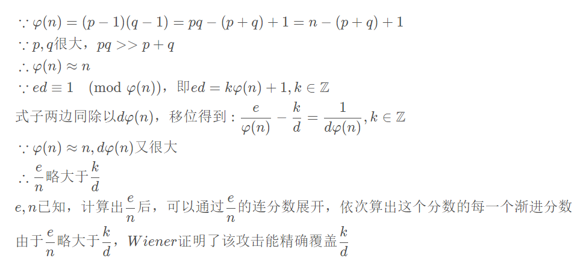
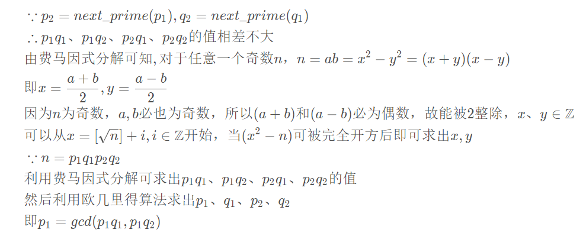

## crypto

### SimpleRSA
```py
from Crypto.Util.number import *
import gmpy2

p, q, r = [getPrime(512) for i in range(3)]
n = p * q * r
phi = (p - 1) * (q - 1) * (r - 1)
d = getPrime(256)
e = gmpy2.invert(d , phi)

flag = b"flag{xxxxxxxxxxxxxxxxxxxxxxxxxxxxxxxxxxxx}"

c = pow(bytes_to_long(flag), e, n)

print(e, n)
print(c)
# e=1072295425944136507039938677101442481213519408125148233880442849206353379681989305000570387093152236263203395726974692959819315410781180094216209100069530791407495510882640781920564732214327898099944792714253622047873152630438060151644601786843683746256407925709702163565141004356238879406385566586704226148537863811717298966607314747737551724379516675376634771455883976069007134218982435170160647848549412289128982070647832774446345062489374092673169618836701679 
# n=1827221992692849179244069834273816565714276505305246103435962887461520381709739927223055239953965182451252194768935702628056587034173800605827424043281673183606478736189927377745575379908876456485016832416806029254972769617393560238494326078940842295153029285394491783712384990125100774596477064482280829407856014835231711788990066676534414414741067759564102331614666713797073811245099512130528600464099492734671689084990036077860042238454908960841595107122933173
#c=1079929174110820494059355415059104229905268763089157771374657932646711017488701536460687319648362549563313125268069722412148023885626962640915852317297916421725818077814237292807218952574111141918158391190621362508862842932945783059181952614317289116405878741758913351697905289993651105968169193211242144991434715552952340791545323270065763529865010326192824334684413212357708275259096202509042838081150055727650443887438253964607414944245877904002580997866300452
```
原理，连分数展开，Wiener 攻击  


```py
from Crypto.Util.number import long_to_bytes
e = 1072295425944136507039938677101442481213519408125148233880442849206353379681989305000570387093152236263203395726974692959819315410781180094216209100069530791407495510882640781920564732214327898099944792714253622047873152630438060151644601786843683746256407925709702163565141004356238879406385566586704226148537863811717298966607314747737551724379516675376634771455883976069007134218982435170160647848549412289128982070647832774446345062489374092673169618836701679
n = 1827221992692849179244069834273816565714276505305246103435962887461520381709739927223055239953965182451252194768935702628056587034173800605827424043281673183606478736189927377745575379908876456485016832416806029254972769617393560238494326078940842295153029285394491783712384990125100774596477064482280829407856014835231711788990066676534414414741067759564102331614666713797073811245099512130528600464099492734671689084990036077860042238454908960841595107122933173
c = 1079929174110820494059355415059104229905268763089157771374657932646711017488701536460687319648362549563313125268069722412148023885626962640915852317297916421725818077814237292807218952574111141918158391190621362508862842932945783059181952614317289116405878741758913351697905289993651105968169193211242144991434715552952340791545323270065763529865010326192824334684413212357708275259096202509042838081150055727650443887438253964607414944245877904002580997866300452

#连分数展开算法
# def lf(x,y):
#     arr=[]
#     while y:
#         arr+=[x//y]
#         x,y=y,x%y
#     return arr
#渐进分数算法
# def jj(k):
#     x=0
#     y=1
#     for i in k[::-1]:
#         x,y=y,x+i*y
#     return (y,x)


data=continued_fraction(e/n)
for x in range(1,len(data)+1):
    # data1=data[:x]
    # d = jj(data1)[1]
    d=data.q(x)
    m = pow(c,d,n)
    flag = long_to_bytes(m)
    if b'flag{' in flag:
        print(x)
        print(d)
        print(flag)
        break
```

### RSASSSS
```py 
from Crypto.Util.number import *
from gmpy2 import next_prime

p = getPrime(512)
q = getPrime(512)

n = p * q * next_prime(p) * next_prime(q)
e = 0x10001

flag = b"flag{xxxxxxxxxxxxxxxxxxxxxxxxxxxxxxxxxxxx}"
cipher = pow(bytes_to_long(flag), e, n)

print(n, cipher)
# n=8030860507195481656424331455231443135773524476536419534745106637165762909478292141556846892146553555609301914884176422322286739546193682236355823149096731058044933046552926707682168435727800175783373045726692093694148718521610590523718813096895883533245331244650675812406540694948121258394822022998773233400623162137949381772195351339548977422564546054188918542382088471666795842185019002025083543162991739309935972705871943787733784491735500905013651061284020447578230135075211268405413254368439549259917312445348808412659422810647972872286215701325216318641985498202349281374905892279894612835009186944143298761257 
#c=3304124639719334349997663632110579306673932777705840648575774671427424134287680988314129312593361087606243819528298610131797078262351307396831985397555390640151391138633431951746748156610463582479645561779194981806129898009876517899450840875569675976765155608446799203699927448835004756707151281044859676695533373755798273892503194753948997947653100690841880925445059175494314198605475023939567750409907217654291430615102258523998394231436796902635077995829477347316754739938980814293304289318417443493019704073164585505217658570214989150175123757038125380996050761572021986573934155470641091678664451080065719261207
```

wp:
```py
#https://github.com/pcw109550/write-up/blob/master/2019/ISITDTU/Easy_RSA_2/solve.py
from Crypto.Util.number import *
from gmpy2 import *

e = 0x10001
n = 8030860507195481656424331455231443135773524476536419534745106637165762909478292141556846892146553555609301914884176422322286739546193682236355823149096731058044933046552926707682168435727800175783373045726692093694148718521610590523718813096895883533245331244650675812406540694948121258394822022998773233400623162137949381772195351339548977422564546054188918542382088471666795842185019002025083543162991739309935972705871943787733784491735500905013651061284020447578230135075211268405413254368439549259917312445348808412659422810647972872286215701325216318641985498202349281374905892279894612835009186944143298761257
c = 3304124639719334349997663632110579306673932777705840648575774671427424134287680988314129312593361087606243819528298610131797078262351307396831985397555390640151391138633431951746748156610463582479645561779194981806129898009876517899450840875569675976765155608446799203699927448835004756707151281044859676695533373755798273892503194753948997947653100690841880925445059175494314198605475023939567750409907217654291430615102258523998394231436796902635077995829477347316754739938980814293304289318417443493019704073164585505217658570214989150175123757038125380996050761572021986573934155470641091678664451080065719261207

def fermat_factorization(n):
	factor_list = []
	get_context().precision = 4096
	x = int(sqrt(n))

	while True:
		x += 1
		y2 = x ** 2 - n
		if is_square(y2):
			#print('x = ',x)
			y2 = mpz(y2)
			get_context().precision = 4096
			y = int(sqrt(y2))
			factor_list.append([x+y, x-y])
		if len(factor_list) == 2:
			break
	return factor_list

def main():
	factor_list = fermat_factorization(n)
	[X1, Y1] = factor_list[0]
	[X2, Y2] = factor_list[1]
	assert X1 * Y1 == n
	assert X2 * Y2 == n
	p1 = gcd(X1, X2)
	q1 = X1 // p1
	p2 = gcd(Y1, Y2)
	q2 = Y1 // p2
	#print('p1 =',p1)
	#print('p2 =',p2)
	#print('q1 =',q1)
	#print('q2 =',q2)

	phi = (p1 - 1) * (q1 - 1) * (p2 - 1) * (q2 - 1)
	d = inverse(e, phi)
	flag = long_to_bytes(pow(c, d, n))
	print(flag)

if __name__ == "__main__":
	main()
```

### more_calc
```py
import gmpy2
from Crypto.Util.number import *

flag = b"flag{xxxxxxxxxxxxxxxxxxxxxxxxxxxxxxxxxxxx}"

p = getStrongPrime(2048)
for i in range(1, (p+1)//2):
    s += pow(i, p-2, p)
s = s % p
q = gmpy2.next_prime(s)
n = p*q
e = 0x10001
c = pow(bytes_to_long(flag), e, n)
print(p)
print(c)
'''
p = 27405107041753266489145388621858169511872996622765267064868542117269875531364939896671662734188734825462948115530667205007939029215517180761866791579330410449202307248373229224662232822180397215721163369151115019770596528704719472424551024516928606584975793350814943997731939996459959720826025110179216477709373849945411483731524831284895024319654509286305913312306154387754998813276562173335189450448233216133842189148761197948559529960144453513191372254902031168755165124218783504740834442379363311489108732216051566953498279198537794620521800773917228002402970358087033504897205021881295154046656335865303621793069
c = 350559186837488832821747843236518135605207376031858002274245004287622649330215113818719954185397072838014144973032329600905419861908678328971318153205085007743269253957395282420325663132161022100365481003745940818974280988045034204540385744572806102552420428326265541925346702843693366991753468220300070888651732502520797002707248604275755144713421649971492440442052470723153111156457558558362147002004646136522011344261017461901953583462467622428810167107079281190209731251995976003352201766861887320739990258601550606005388872967825179626176714503475557883810543445555390014562686801894528311600623156984829864743222963877167099892926717479789226681810584894066635076755996423203380493776130488170859798745677727810528672150350333480506424506676127108526488370011099147698875070043925524217837379654168009179798131378352623177947753192948012574831777413729910050668759007704596447625484384743880766558428224371417726480372362810572395522725083798926133468409600491925317437998458582723897120786458219630275616949619564099733542766297770682044561605344090394777570973725211713076201846942438883897078408067779325471589907041186423781580046903588316958615443196819133852367565049467076710376395085898875495653237178198379421129086523
'''
```

wp:
```py

import gmpy2
from Crypto.Util.number import *
p = 27405107041753266489145388621858169511872996622765267064868542117269875531364939896671662734188734825462948115530667205007939029215517180761866791579330410449202307248373229224662232822180397215721163369151115019770596528704719472424551024516928606584975793350814943997731939996459959720826025110179216477709373849945411483731524831284895024319654509286305913312306154387754998813276562173335189450448233216133842189148761197948559529960144453513191372254902031168755165124218783504740834442379363311489108732216051566953498279198537794620521800773917228002402970358087033504897205021881295154046656335865303621793069
c = 350559186837488832821747843236518135605207376031858002274245004287622649330215113818719954185397072838014144973032329600905419861908678328971318153205085007743269253957395282420325663132161022100365481003745940818974280988045034204540385744572806102552420428326265541925346702843693366991753468220300070888651732502520797002707248604275755144713421649971492440442052470723153111156457558558362147002004646136522011344261017461901953583462467622428810167107079281190209731251995976003352201766861887320739990258601550606005388872967825179626176714503475557883810543445555390014562686801894528311600623156984829864743222963877167099892926717479789226681810584894066635076755996423203380493776130488170859798745677727810528672150350333480506424506676127108526488370011099147698875070043925524217837379654168009179798131378352623177947753192948012574831777413729910050668759007704596447625484384743880766558428224371417726480372362810572395522725083798926133468409600491925317437998458582723897120786458219630275616949619564099733542766297770682044561605344090394777570973725211713076201846942438883897078408067779325471589907041186423781580046903588316958615443196819133852367565049467076710376395085898875495653237178198379421129086523


n=p
d=gmpy2.invert(0x10001,n-1)
print(long_to_bytes(gmpy2.powmod(c,d,n)))

