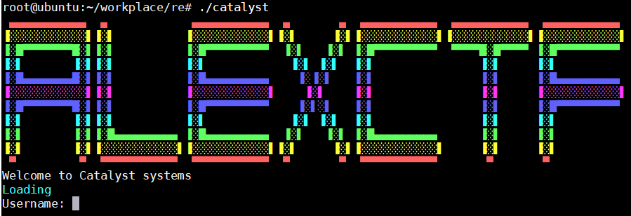
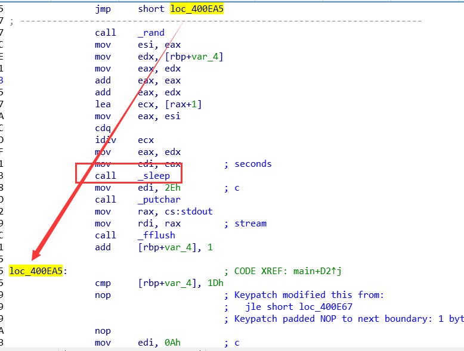
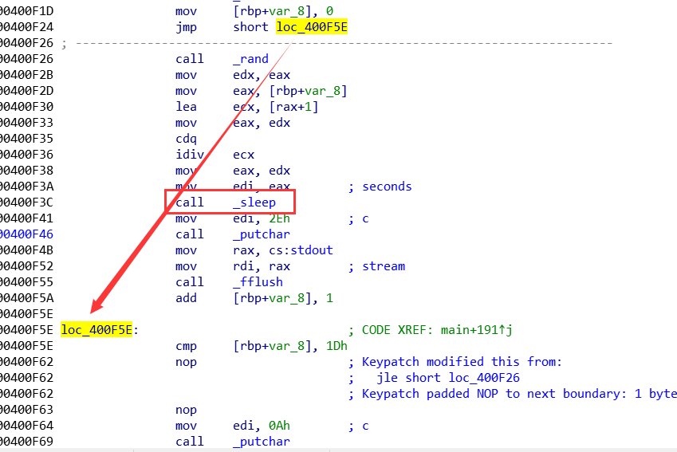
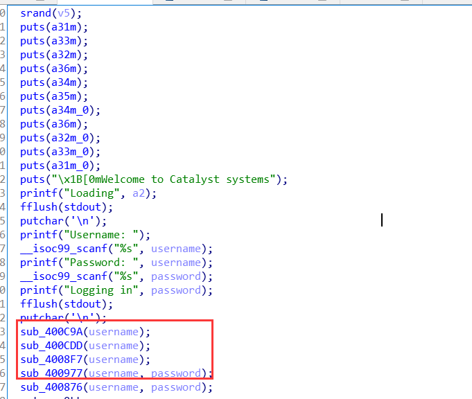
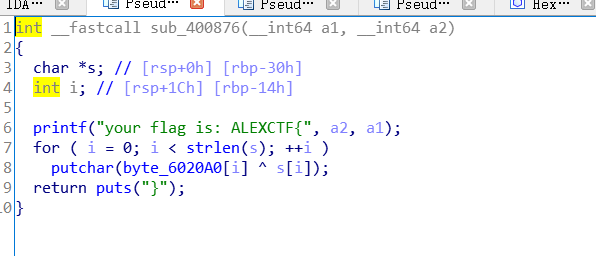

## catalyst

长这样子


### patch

要先修掉若干个alarm，sleep..
- 开始有一个

- 中间也有很多

后面略。

需要过掉四个检测到达这里



### 第一个
for循环判断a1(username)的长度，然后将长度传入到sub_400C41(i)
```c
__int64 __fastcall sub_400C9A(__int64 a1)
{
  int i; // [rsp+1Ch] [rbp-4h]

  for ( i = 0; i <= 49 && *(i + a1); ++i )
    ;
  return sub_400C41(i);
}
```
传入长度后，再对长度进行判断，if中的表达式可以用z3来求解

```c
__int64 __fastcall sub_400C41(int len_username)
{
  __int64 result; // rax

  if ( 4 * (len_username >> 2) != len_username
    || 4 * (len_username >> 4) == len_username >> 2
    || (result = (len_username >> 3), !result)
    || len_username >> 4 )
  {
    puts("invalid username or password");
    exit(0);
  }
  return result;
}
```
```py
from z3 import *
x = BitVec('x',32)

solve(
    x<50,
    4*(x>>2)==x,
    4*(x>>4)!=x>>2,
    x>>4==0,
    x>>3!=0
)
```
解得长度必须是8位或者12位。

### 第二个判断

```c
signed __int64 __fastcall sub_400CDD(unsigned int *uesrname)
{
  signed __int64 result; // rax
  __int64 v2; // [rsp+10h] [rbp-20h]
  __int64 v3; // [rsp+18h] [rbp-18h]
  __int64 v4; // [rsp+20h] [rbp-10h]
// username array
  v4 = *uesrname;
  v3 = uesrname[1];
  v2 = uesrname[2];
  if ( v4 - v3 + v2 != 0x5C664B56
    || v3 + 3 * (v2 + v4) != 0x2E700C7B2LL
    || (result = 0x32AC30689A6AD314LL, v2 * v3 != 0x32AC30689A6AD314LL) )
  {
    puts("invalid username or password");
    exit(0);
  }
  return result;
}
```
将username看作了4字节，并带入进行运算。同样可以用z3来求解

```py
from z3 import *
import binascii
v4=BitVec('v4',64)#  solved:1635017059 atac
v3=BitVec('v3',64)#         1953724780 tsyl
v2=BitVec('v2',64)#         1868915551 oec_
solve(
    v4-v3+v2==0x5C664B56,
    v3+3*(v2+v4)==0x2E700C7B2,
    v2*v3==0x32AC30689A6AD314
)
# 可以用下面方法将16进制的字符串转为ascii，但注意小端存储
h=hex(1868915551)
print(h)
print(binascii.a2b_hex(h[2:]))
# 下面也是可以的，而且更简单.. 
u=[1635017059,1953724780,1868915551]
username=''
for x in u:
    username+=x.to_bytes(4).decode()
print(username)
```
得到username=catalyst_ceo
### 第三、四个
第三个主要判断username是否合法，由于通过第二个检测函数已经解开了username，所以忽略吧..
```c
__int64 __fastcall sub_4008F7(__int64 username)
{
  __int64 result; // rax
  int i; // [rsp+1Ch] [rbp-4h]

  for ( i = 0; ; ++i )
  {
    result = *(i + username);
    if ( !result )
      break;
    if ( (*(i + username) <= '`' || *(i + username) > 'z') && *(i + username) != '_' )
    {
      puts("invalid username or password");
      exit(0);
    }
  }
  return result;
}
```
第四个
```c
__int64 __fastcall sub_400977(_DWORD *username, _DWORD *password)
{
  int v2; // ebx
  int v3; // ebx
  int v4; // ebx
  int v5; // ebx
  int v6; // ebx
  int v7; // ebx
  int v8; // ebx
  int v9; // ebx
  int v10; // ebx
  int v11; // ebx
  unsigned int v12; // ebx
  __int64 result; // rax
  int i; // [rsp+2Ch] [rbp-14h]

  for ( i = 0; *(password + i); ++i )
  {
    if ( (*(password + i) <= '`' || *(password + i) > 'z')
      && (*(password + i) <= '@' || *(password + i) > 'Z')
      && (*(password + i) <= '/' || *(password + i) > '9') )
    {
      puts("invalid username or password");
      exit(0);
    }
  }
  srand(username[1] + *username + username[2]);
  v2 = *password;
  if ( v2 - rand() != 1441465642 )
  {
    puts("invalid username or password");
    exit(0);
  }
  v3 = password[1];
  if ( v3 - rand() != 251096121 )
  {
    puts("invalid username or password");
    exit(0);
  }
  v4 = password[2];
  if ( v4 - rand() != -870437532 )
  {
    puts("invalid username or password");
    exit(0);
  }
  v5 = password[3];
  if ( v5 - rand() != -944322827 )
  {
    puts("invalid username or password");
    exit(0);
  }
  v6 = password[4];
  if ( v6 - rand() != 647240698 )
  {
    puts("invalid username or password");
    exit(0);
  }
  v7 = password[5];
  if ( v7 - rand() != 638382323 )
  {
    puts("invalid username or password");
    exit(0);
  }
  v8 = password[6];
  if ( v8 - rand() != 282381039 )
  {
    puts("invalid username or password");
    exit(0);
  }
  v9 = password[7];
  if ( v9 - rand() != -966334428 )
  {
    puts("invalid username or password");
    exit(0);
  }
  v10 = password[8];
  if ( v10 - rand() != -58112612 )
  {
    puts("invalid username or password");
    exit(0);
  }
  v11 = password[9];
  v12 = v11 - rand();
  result = v12;
  if ( v12 != 605226810 )
  {
    puts("invalid username or password");
    exit(0);
  }
  return result;
}
```
传入username，password进行运算，步骤及如下：

1. 先判断密码范围，不可打印就报错，  
2. 通过`srand(username[1] + *username + username[2]);`设定随机数种子  
3. 再对password每四字节减去`rand()`，判断结果是否和目标值相等  
   
枚举出随机数。
```c
#include<stdio.h>
int main(){
        unsigned int u[10];
        u[0]=1635017059;
        u[1]=1953724780;
        u[2]=1868915551;
        srand(u[1]+u[0]+u[2]);
        int i,a=0;
        for(i=0;i<10;i++){
                a=rand();
                printf("%d\n",a);
        }
        puts(u);
}
/*
output:

6833993
1732044087
2068121063
1889579618
869606716
1364883061
1500347741
2094174281
1508322742
1179934733
catalyst_ceo
*/
```
逆向出password并输出
```py
import binascii
rands=[6833993,1732044087,2068121063,1889579618,869606716,1364883061,1500347741,2094174281,1508322742,1179934733
]
a=[1441465642,251096121,-870437532,-944322827,647240698,638382323,282381039,-966334428,-58112612,605226810
]
i=0
sum=[]
while(i<10):
    # 逆向出密码
    sum.append(a[i]+rands[i])
    i=i+1
print(sum)
passwd=b''
for x in sum:
    #小端转换并打印
    passwd+=binascii.a2b_hex(hex(x)[2:])[::-1]
print(passwd)
#output:
sLSVpQ4vK3cGWyW86AiZhggwLHBjmx9CRspVGggj
```
### flag
输入用户名密码后拿到flag:`ALEXCTF{1_t41d_y0u_y0u_ar3__gr34t__reverser__s33}`