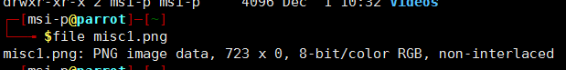
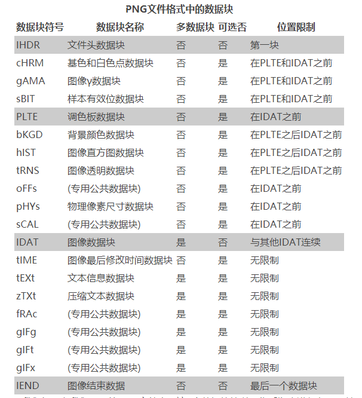
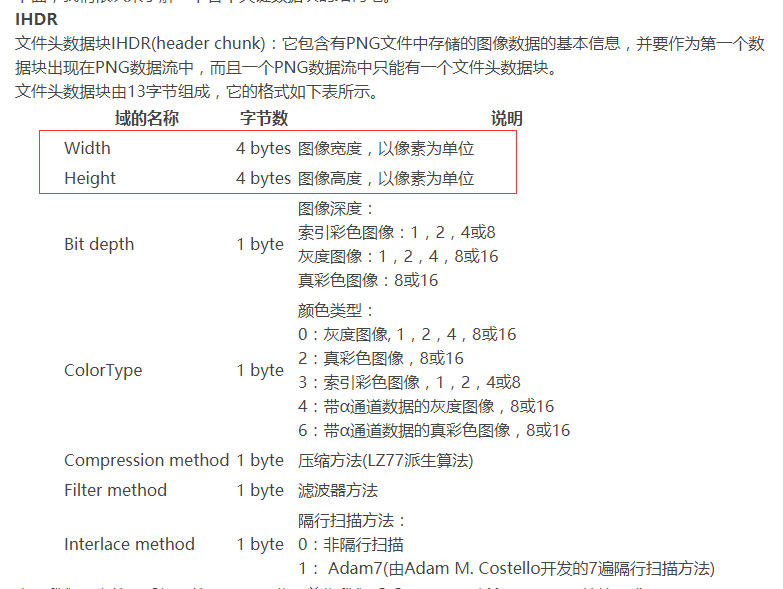
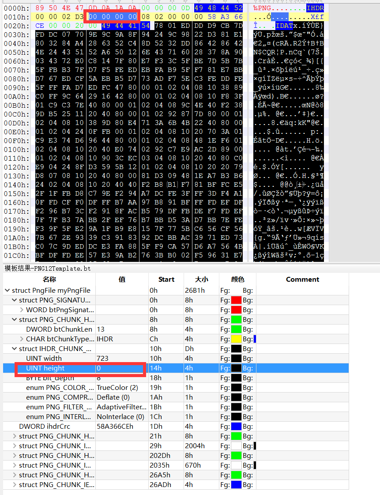
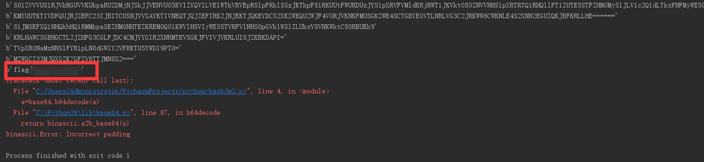
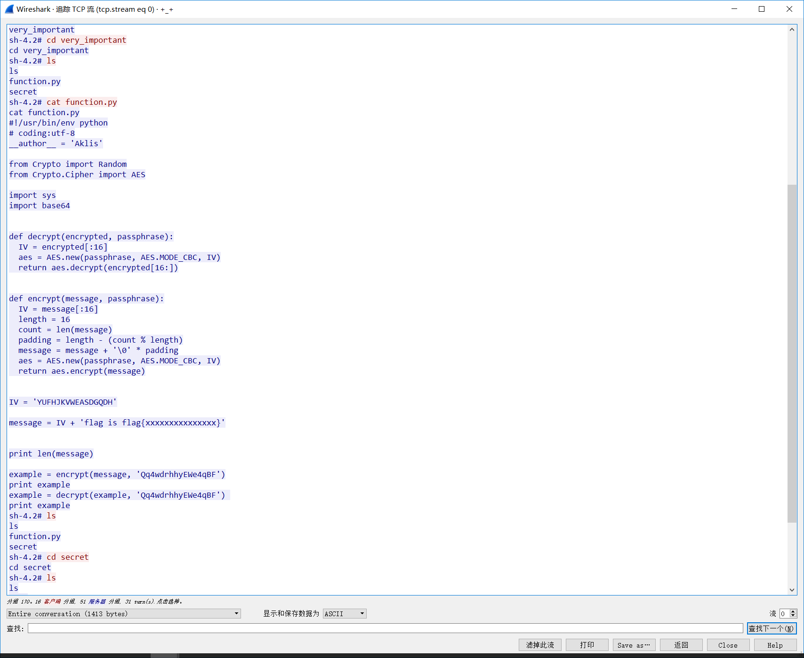

# misc

常用工具，binwalk file命令

## misc1

知识点：png图片格式，linux file命令

在parrot中使用file命令查看：


哪里有高度为0的图片？？



修改图片高度。



这个软件是010Editor



改一个大点的数。保存。查看图片。

## misc2

base64解码..


发现是base32，再解码，发现是base64的，那就写脚本，一直解..



这里给出一个脚本

```py
a='' #那个字符串，不粘贴过来了，太长了
for x in range(10):
    a = base64.b64decode(a)
    print(a)
    a = base64.b32decode(a)
    print(a)
```

## 数据分析

丢parrot，`binwalk -eM flag`
然后查看flag.txt

## 流量分析

丢wireshark追踪tcp字节流。



令example的值为：

```py
    example=base64.b64decode('mbZoEMrhAO0WWeugNjqNw2odgCp1uOAXYSakNQBvXG4nyCTAdaFqkTssZ+cSJKdEDUpkRXo2sI1bGhcxE+JKlg==')
    example = decrypt(example, 'Qq4wdrhhyEWe4qBF') 
    print example
```