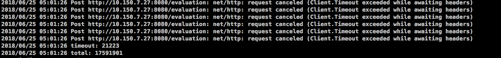
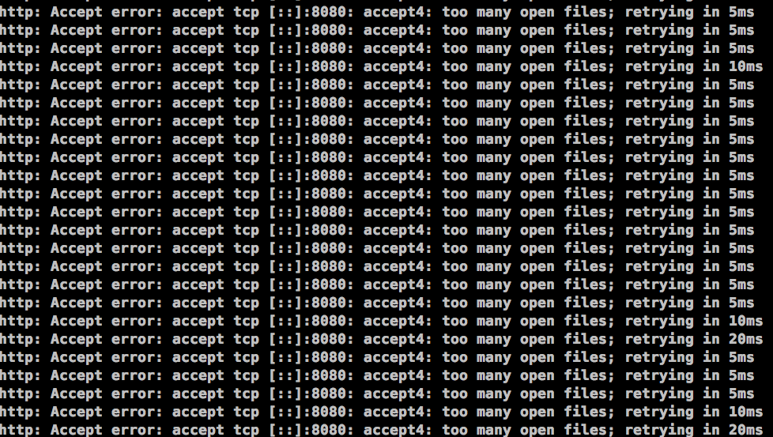

# 性能优化
- 关闭防火墙(iptables selinux)
- 检查开机启动项
- 调整文件描述符限制
    1. vim /etc/security/limits.conf
        写入`*  - nofile 65535`
    2. ulimit -SHn 65535 加入/etc/rc.local


## redhat
tuned-adm profile network-latency
这个会更改syscyl来降低延时，吞吐量也会降低
```conf
作者：hugulas
链接：https://zhuanlan.zhihu.com/p/434558326
来源：知乎
著作权归作者所有。商业转载请联系作者获得授权，非商业转载请注明出处。

# 要全局启用繁忙轮询， 须将 sysctl.net.core.busy_read 设置为除了 0 以外的值。这一参数控制了socket 读取位于等待设备队列中数据包的微秒数，且设置了 SO_BUSY_POLL 选项的默认值。红帽推荐在 socket 数量少时将值设置为 50 ，socket数量多时将值设置为 100。(https://access.redhat.com/documentation/zh-cn/red_hat_enterprise_linux/7/html/performance_tuning_guide/sect-red_hat_enterprise_linux-performance_tuning_guide-networking-configuration_tools)
net.core.busy_read=50        
# 繁忙轮询有助于减少网络接收路径中的延迟， 使 socket 层代码查询网络设备的接收队列并禁用网络中断，这可以消除由于中断和由此产生的环境切换所造成的延误。但是，它会增加 CPU 的使用率。 这一参数控制的是 socket 轮询和选择位于等待设备队列中数据包的微秒数。红帽推荐值为 50。(https://access.redhat.com/documentation/zh-cn/red_hat_enterprise_linux/7/html/performance_tuning_guide/sect-red_hat_enterprise_linux-performance_tuning_guide-networking-configuration_tools)
net.core.busy_poll=50   
# TFO提高性能的关键是省去了热请求的三次握手，这在充斥着小对象的移动应用场景中能够极大提升性能。设置为3表示server和client都打开TFO。 
net.ipv4.tcp_fastopen=3
# 禁用自动化NUMA平衡来避免计划外的搬线程和内存的影响（https://access.redhat.com/sites/default/files/attachments/201501-perf-brief-low-latency-tuning-rhel7-v2.1.pdf）
kernel.numa_balancing=0
# 内核命令行参数skew_tick有助于平滑对延迟敏感的应用程序在中大型系统上的抖动。实时 Linux 系统上延迟峰值的常见来源是多个 CPU 争用 Linux 内核计时器ticks处理程序中的公共锁。负责争用的常用锁xtime_lock是计时系统使用的 和 RCU（读取-复制-更新）结构锁。
# 使用skew_tick=1引导参数可减少对这些内核锁的争用。该参数通过使它们的开始时间“倾斜”来确保每个 CPU 的ticks不会同时发生。调整每个 CPU 计时器ticks的开始时间会降低锁定冲突的可能性，从而减少中断响应时间的系统抖动。
# Using the skew_tick=1 boot parameter reduces contention on these kernel locks. The parameter ensures that the ticks per CPU do not occur simultaneously by making their start times 'skewed'. Skewing the start times of the per-CPU timer ticks decreases the potential for lock conflicts, reducing system jitter for interrupt response time （https://access.redhat.com/documentation/en-us/red_hat_enterprise_linux_for_real_time/7/html/tuning_guide/reduce_cpu_performance_spikes）
cmdline_network_latency=skew_tick=1
force_latency=cstate.id:1|3
governor=performance
energy_perf_bias=performance
min_perf_pct=100
```
## network
监控工具 dstat -n -N lo
```conf
fs.file-max = 1000000
fs.inotify.max_user_instances = 8192
net.core.netdev_max_backlog = 65536
net.core.optmem_max = 65536 
net.core.rmem_default = 8388608
net.core.wmem_default = 8388608
net.core.rmem_max = 16777216
net.core.wmem_max = 16777216
net.core.somaxconn = 32768
net.ipv4.tcp_fin_timeout = 15
net.ipv4.tcp_slow_start_after_idle = 0
net.ipv4.tcp_max_tw_buckets = 65536
net.ipv4.tcp_tw_reuse = 1
net.ipv4.tcp_window_scaling = 1
net.ipv4.tcp_keepalive_time = 60
net.ipv4.tcp_keepalive_intvl = 10
net.ipv4.tcp_keepalive_probes = 6
net.ipv4.tcp_max_syn_backlog = 65536
net.ipv4.tcp_rmem = 4096 87380 16777216
net.ipv4.tcp_wmem = 4096 65536 16777216
net.ipv4.udp_rmem_min = 16384
net.ipv4.udp_wmem_min = 16384
net.ipv4.ip_local_port_range = 1024  65535
net.core.default_qdisc = fq
net.ipv4.tcp_congestion_control = bbr


```




## mysql
更改最大连接数
