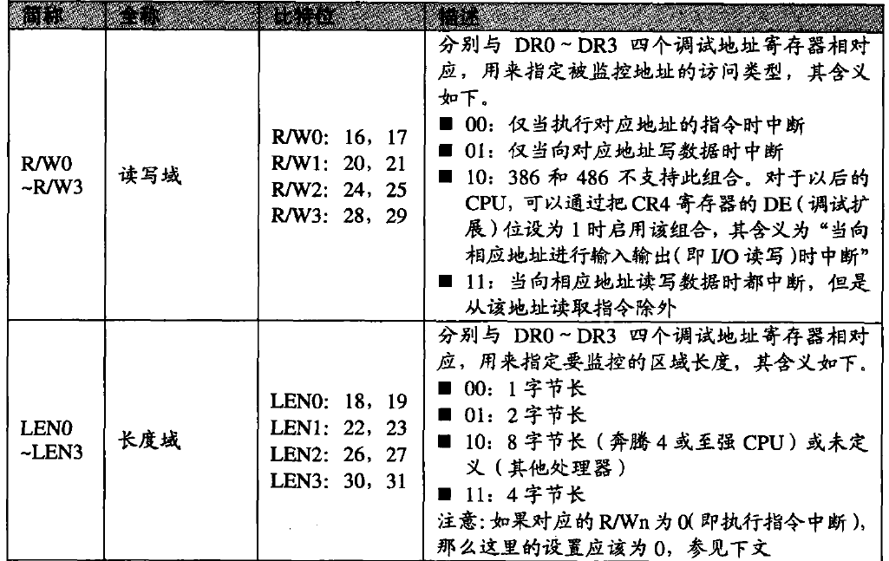
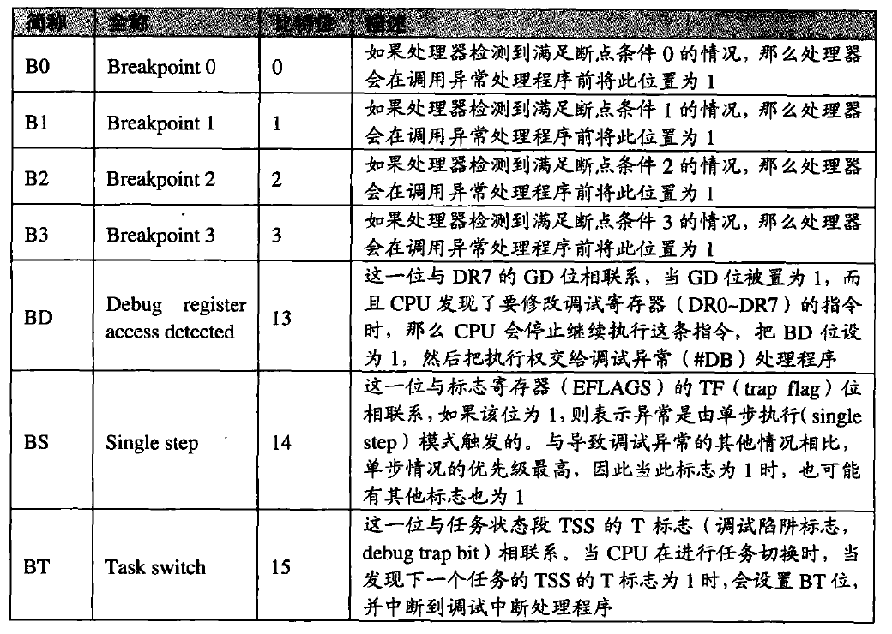

## 中断(interrupt)

不管是软中断还是硬中断，都是为了让 CPU 放下当前任务去干别的事情..比如说 IO
有一个表对应了不同的中断类型-中断向量表。

## 异常(exception)

分为两大类，错误和陷阱，区别是从哪恢复执行。
错误：除 0，非法访问，缺页等。触发错误处理，然后再从会产出错误的代码执行。  
陷阱：0xcc、SYSENTER 系统调用等。从下一条指令开始执行。
中止：通常是一些严重错误，CPU 中止程序的执行并报告错误，而且不再恢复执行（指令无需压栈，通常可以看到当前的栈快照）。如越界访问或溢出。
中断和异常有相同的处理过程：

在处理多个中断和异常时有优先级顺序：


## 断点

硬件断点

```c
HANDLE SetHardwareBreakpoint(HANDLE hThread,HWBRK_TYPE Type,HWBRK_SIZE Size,void* s);
```

DR0~DR3 保存地址，DR4 DR5 没用，DR7 用来设置断点条件，DR6 反应断点状态。
//TODO: 图片转表格。




单步执行(step in)

1. 通过调试符号获取当前指令对应的行信息，并保存该行的信息。

2. 设置 TF 位，开始 CPU 的单步执行。

3. 在处理单步执行异常时，获取当前指令对应的行信息，与 ① 中保存的行信息进行比较。如果相同，表示仍然在同一行上，转到 ②；如果不相同，表示已到了不同的行，结束 StepIn。

## 各种 OEP

### delphi

```
55            PUSH EBP
8BEC          MOV EBP,ESP
83C4 F0       ADD ESP,-10
B8 A86F4B00   MOV EAX,PE.004B6FA8
```

### vc++

```
55            PUSH EBP
8BEC          MOV EBP,ESP
83EC 44       SUB ESP,44
56            PUSH ESI
```

### vc6.0

```
55                 push ebp
8BEC               mov ebp,esp
6A FF              push -1
```

### vc7.0

```
6A 70              push 70
68 50110001        push hh.01001150
E8 1D020000        call hh.010017B0
33DB               xor ebx,ebx
```

### vs2015 debug
```
83EC 1C          SUB ESP, 1C                        
C70424 01000000  MOV DWORD PTR SS:[ESP], 1          
FF15 04614000    CALL DWORD PTR DS:[<&__set_app_type>]
E8 6BFDFFFF      CALL 新年快乐_dump_scy.401000          
```

## intel 指令编码方式

每一个指令分为 6 部分：

1. prefix 1byte
2. opcode 1~3byes
3. ModR/M 1byte(if reqired)
4. SIM 1byte(if required)
5. Address displacement 0~4byes
6. immediate data 0~4bytes
7. x64 还有 REX 前缀，在 prefix 和 opcode 之间

### prefix

指令前缀，一共五种：

1. LOCK 0xf0 禁止数据线服用，一般很少用
2. REPNE/REPNZ 0xf2 用 RCX/ECX/CX 寄存器作为指令是否重复执行的依据
3. REP/REPE/REPZ 0xf3 同上
