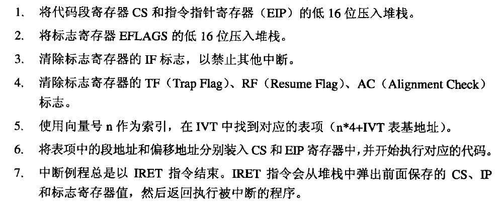
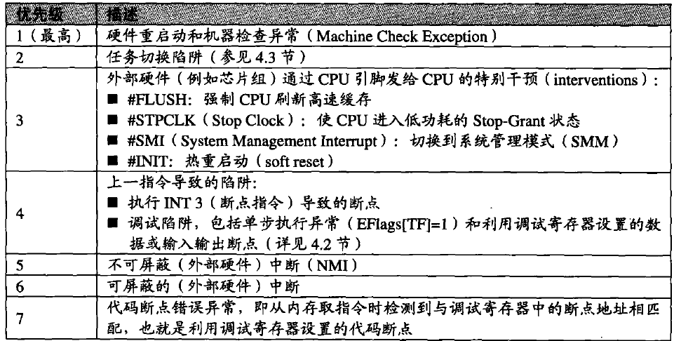
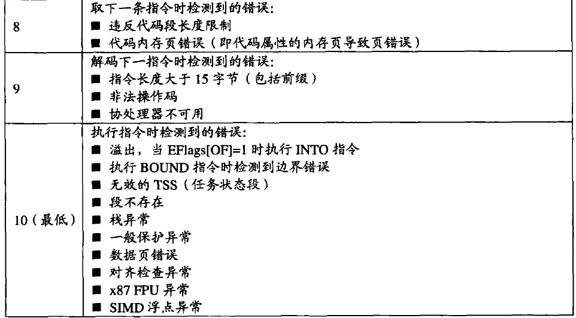

## 中断(interrupt)

不管是软中断还是硬中断，都是为了让 CPU 放下当前任务去干别的事情..比如说 IO
有一个表对应了不同的中断类型-中断向量表。

## 异常(exception)

分为两大类，错误和陷阱，区别是从哪恢复执行。
错误：除 0，非法访问，缺页等。触发错误处理，然后再从会产出错误的代码执行。  
陷阱：0xcc、SYSENTER 系统调用等。从下一条指令开始执行。
中止：通常是一些严重错误，CPU中止程序的执行并报告错误，而且不再恢复执行（指令无需压栈，通常可以看到当前的栈快照）。如越界访问或溢出。 
中断和异常有相同的处理过程：

在处理多个中断和异常时有优先级顺序：



## 断点
硬件断点
```c
HANDLE SetHardwareBreakpoint(HANDLE hThread,HWBRK_TYPE Type,HWBRK_SIZE Size,void* s);
```
DR0~DR3保存地址，DR4 DR5没用，DR7用来设置断点条件，DR6反应断点状态。
//TODO: 图片转表格。


单步执行(step in)
1. 通过调试符号获取当前指令对应的行信息，并保存该行的信息。

2. 设置TF位，开始CPU的单步执行。

3. 在处理单步执行异常时，获取当前指令对应的行信息，与①中保存的行信息进行比较。如果相同，表示仍然在同一行上，转到②；如果不相同，表示已到了不同的行，结束StepIn。