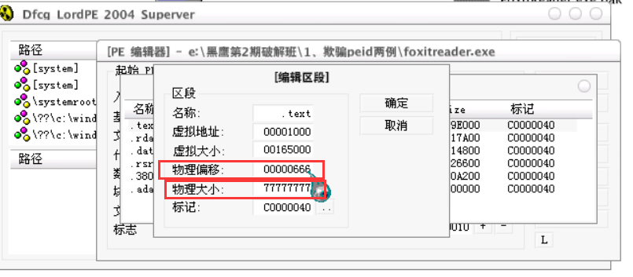
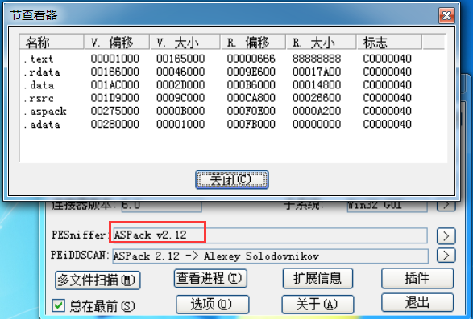
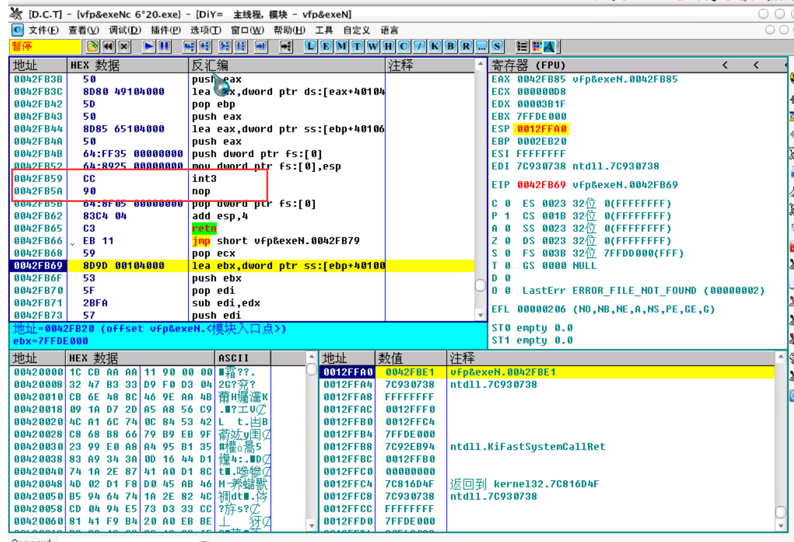

## 欺骗PEID
aspack加壳后，更改物理偏移在600-700之间，物理大小随便大，不过貌似在v0.95无效了

伪装壳最好的是hying
北斗特征
popad
popfd

## 无端加花指令
一定占用空间，申请内存存放花指令，一定会释放
command下断：
bp VirtualFree
执行到用户返回
virtual memory

远call F7 近call F8

两字节的代码被改了，在下面一条指定下断F2

## 脱壳
1. kkrunchy  LoadLibraryA 下断点，F9运行。