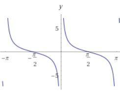
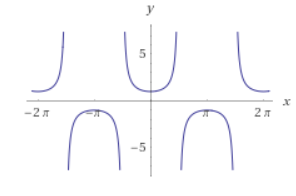
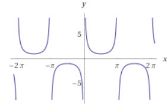
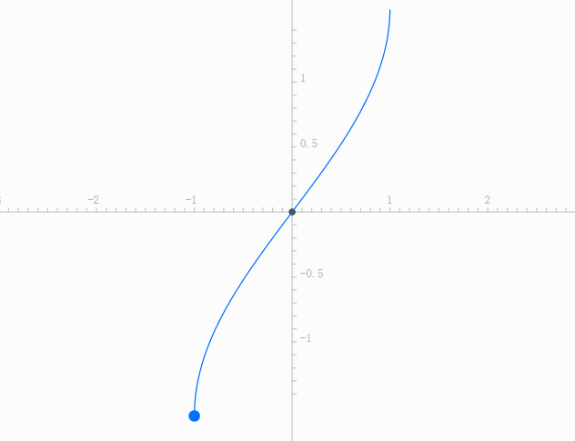
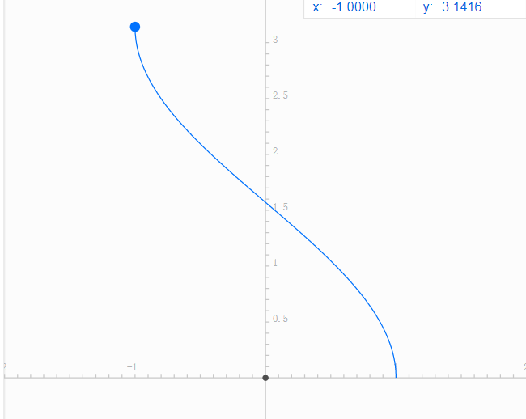
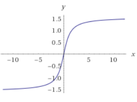
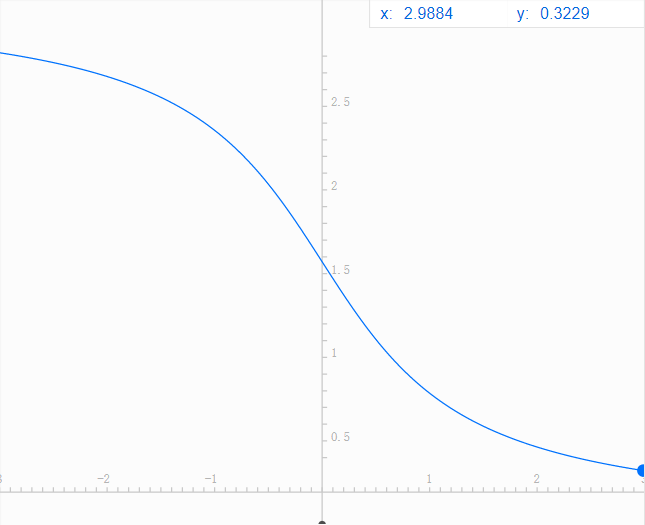

## 三角函数

## $y=\cot{x}$

  
定义域: $x\neq k\pi (k \in \bold{Z})$  
值域: $(-\infty ,+\infty)$  
求导: $\frac{d \cot x}{dx}=-\csc^2(x)$  
积分: $\int \cot x dx = \ln (\sin x)$ + C

## $y=\sec x$

  
定义域: $x\neq \frac{\pi}{2}+k\pi (k \in \bold{Z})$  
值域: $(-\infty,-1] \cup [1,\infty)$  
导数: $\frac{d\sec x}{dx} = \tan x \sec x$  
积分:$\int \sec dx = \ln |\tan x + \sec x|$

## $y=\csc x$

  
定义域:$x\neq k\pi (k \in \bold{Z})$
值域: $(-\infty,-1] \cup [1,\infty)$  
求导: $\frac{d\csc x}{dx}= -\cot x \csc x$  
积分: $\int \csc xdx = -\ln|\csc x- \cot x|+C$

## $y=\arcsin x$

定义域:$[-1,1]$  
值域:$[-\frac{\pi}{2},\frac{\pi}{2}]$  
导数:$\frac{d\arcsin x}{dx}=\frac{1}{\sqrt{1-x^2}}$  
积分: $\int \arcsin xdx=\sqrt{1-x^2}+x\arcsin x+C$

## $y=\arccos x$

定义域: $[-1,1]$  
值域: $\left[0,\pi \right]$  
导数:$\frac{d \arccos x }{dx}=-\frac{1}{\sqrt{1-x^2}}$  
积分:$\int \arccos xdx=x\arccos x - \sqrt{1-x^2}$

## $y=\arctan x$

  
定义域：$(-\infty,+\infty)$  
值域：$(-\frac{\pi}{2},+\frac{\pi}{2})$  
导数：$\frac{\arctan x}{dx}=\frac{1}{x^2+1}$  
积分：$\int \arctan x dx = x \arctan x - \frac{1}{2}\ln (x^2+1)$

## $y=arccot x$

  
定义域：$(-\infty,+\infty)$  
值域：$(0,\pi)$  
导数：$\frac{d arccot x}{dx}=-\frac{1}{1+x^2}$  
积分：$\int arccotx dx=\frac{1}{2}\ln(x^2+1)+xarccot(x)+C$

## 等价无穷小

$$1-\cos x \sim \frac{1}{2}x^2$$

$$(1+x)^2 \sim ax$$

$$ x \sim \sin x \sim \tan x \sim \arcsin x \sim \arctan x \sim e^x -1 $$

## 求导

1. 分解法求高阶导

    若$f(x)$可以分解为$f_{1}(x)+f_{2}(x)$,若知道$f_{1}^{(n)}(x)+f_{2}^{(n)}(x)$,则$f^{(n)}(x)=f_{1}^{(n)}(x)+f_{2}^{(n)}(x)$

1. 常用的高阶导
    - $(e^{ax+b})^{(n)}=a^n+e^{ax+b}$
    - $[sin(ax+b)]^{(n)}=a^n sin(ax+b+\frac{n\pi}{2})$
    - $[cos(ax+b)]^{(n)}=a^n cos(ax+b+\frac{n\pi}{2})$
    - $[\ln(ax+b)]^{(n)}=(-1)^{n-1} a^n\frac{(n-1)!}{(ax+b)^n}$
    - $(\frac{1}{ax+b})^{(n)}=(-1)^n a^n\frac{n!}{(ax+b)^{n+1}}$

## 积分

$$ \int \frac{dx}{ax+b} = \frac{1}{a}\ln{|ax+b|}+C$$

$$ \int\sqrt{ax+b}dx = \frac{2}{3a}\sqrt{(ax+b)^3}+C $$

$$ \int \frac{t^2}{e^t}dt = t^2e^{-t}+2te^{-t}-2e^{-t}+C $$

$$\int \frac{dx}{x \sqrt{ax+b}} = \begin{cases} \frac{1}{\sqrt{b}}\ln \left|\frac{\sqrt{ax+b}-\sqrt{b}}{\sqrt{ax+b}+\sqrt{b}}\right|+C &(b>0)\\ \\ \frac{2}{\sqrt{-b}}\arctan \sqrt{\frac{ax+b}{-b}}+C & (b<0) \end{cases} $$

$$ \int \frac{dx}{x^2+a^2} = \frac{1}{a}\arctan\frac{x}{a}+C$$

$$ \int \frac{dx}{x^2-a^2} = \frac{1}{2a}\ln\left|\frac{x-a}{x+a}\right|+C $$

$$
    \int \frac{dx}{ax^2+b} =
    \begin{cases}
    \frac{1}{\sqrt{ab}}\arctan \sqrt{\frac{a}{b}}x +C
    \\\\
    \frac{1}{2\sqrt{-ab}}\ln \left| \frac{\sqrt{a}x-\sqrt{-b}}{\sqrt{a}x+\sqrt{-b}}\right|+C
\end{cases}
$$

$$\int \frac{dx}{\sqrt{x^2\pm a^2}}=\ln(x+\sqrt{x^2 \pm a^2})+C$$

$$ \int \frac{x}{\sqrt{x^2+a^2}}dx=\sqrt{x^2+a^2}+C$$

$$\int \frac{dx}{\sqrt{a^2-x^2}}=\arcsin\frac{x}{a}+C$$

$$\int \sqrt{x^2+a^2}dx=\frac{x}{2}\sqrt{x^2+a^2}+\frac{a^2}{2}\ln(x+\sqrt{x^2+a^2})+C$$

$$\int \sqrt{x^2-a^2}dx=\frac{x}{2}\sqrt{x^2-a^2}+\frac{a^2}{2}\ln\left|x+\sqrt{x^2-a^2})\right|+C$$

$$\int \sqrt{a^2-x^2}=\frac{x}{2}\sqrt{a^2-x^2}+\frac{a^2}{2}\arcsin \frac{x}{a}+C$$

### 题目

https://zhuanlan.zhihu.com/p/78850527
https://zhuanlan.zhihu.com/p/99890863
