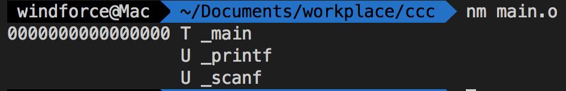

## 相关论坛
openrce.org
woodmann.com
hexblog.com
//todo
https://github.com/michalmalik/linux-re-101
### java逆向
clss逆向工具：jad

### PC

#### nm 
列举目标文件中的符号
```c
#include<stdio.h>
int main(int argc, char const *argv[])
{
    int a=4;
    float b=0;
    scanf("%f",&b);
    printf("%f",a+b);

    return 0;
}

```



    U:  未定义符号，通常为外部符号饮用
    T:  在文本部分定义的符号，通常为函数名称
    t:  在文本部分定义的局部符号，在C语言中，这个符号通常等同于一个静态函数
    D:  已初始化数值
    C:  为初始化数值
    
上述文件仅进行了编译，并未进行连接。
### ldd&otool -L&dumpbin /dependents 
依次为linux mac win下查看动态链接库的工具
### objdump
一个反汇编工具，线性扫描算法。

解析elf文件还有`readelf`
### 静态连接和动态链接
静态连接体积大，因为包含了运行库。
### Apktool
　　APKTool 是 GOOGLE 提供的 APK 编译工具。能够反编译及回编译 apk，同时安装反编译系统 apk 所需要的 framework-res 框架。
　　作用：资源文件获取，可以提取出图片文件和布局文件进行使用查看。


### D2j-dex2jar
　　反编译 dex 文件到 jar 文件，进而可以用其他工具查看源代码。dex2jar是一款很不错的将android的.dex文件转换成Java的.class文件的转换工具，dex2jar是一个能操作Android的dalvik(.dex)文件格式和Java的(.class)的工具集合

### Javasnoop
　　Javasnoop 是一个 java 应用程序安全测试工具，它允许你以拦截的方法，篡改数据和hack 运行在你计算机上的 java 应用程序。通常在没有源代码的情况下，测试 java 客户端 的安全性最好的结果是不可预知的，最坏的结果是不切实际的。
　　一个连接到目标机器的Java代理与JavaSnoop工具连接来测试该机器上的应用程序以便寻找其安全弱点。它可以是一个安全工具也可以成为黑客工具。

### z3
两种写法都行，常用的
```py
from z3 import *
x = BitVec('x',32)

solve(
    x<50,
    4*(x>>2)==x,
    4*(x>>4)!=x>>2,
    x>>4==0,
    x>>3!=0
)
```
Solver:
```py
from z3 import *

x = BitVec('x',32)
s = Solver()
s.add(x<50)
s.add(4*(x>>2)==x)
s.add(4*(x>>4)!=x>>2)
s.add(x>>4!=0)
s.add(x>>3!=0)
for c in s.assertions():
    print (c)
print(s.check())
for k,v in s.statistics():
    print(k,v)
m=s.model()
print(m)
```